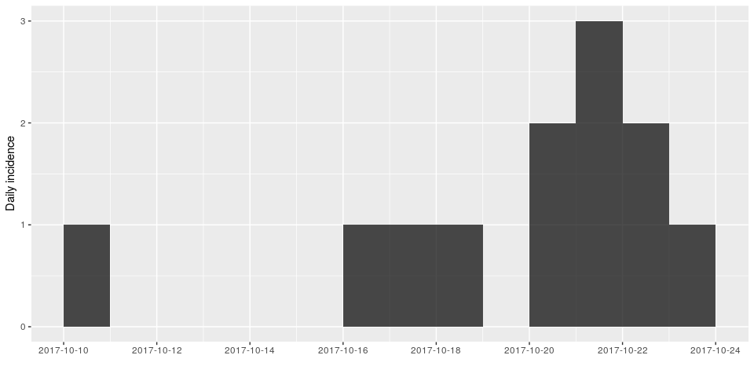
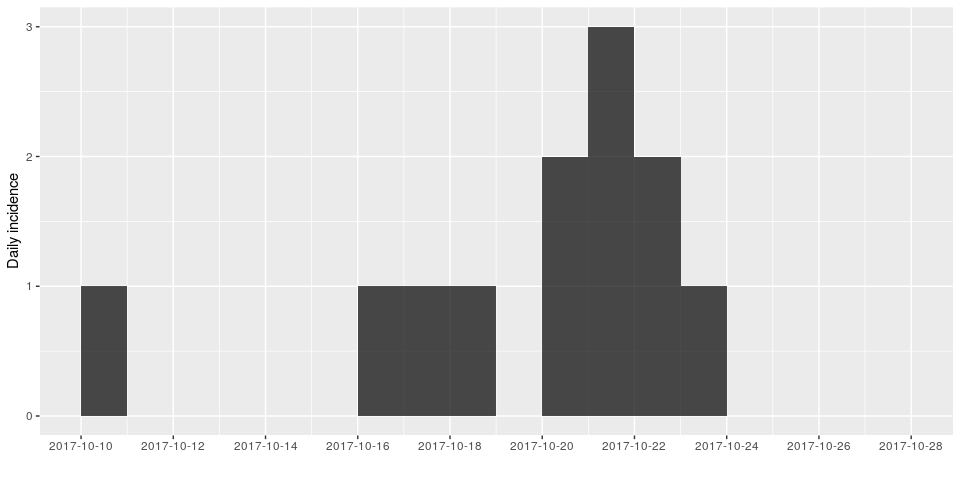
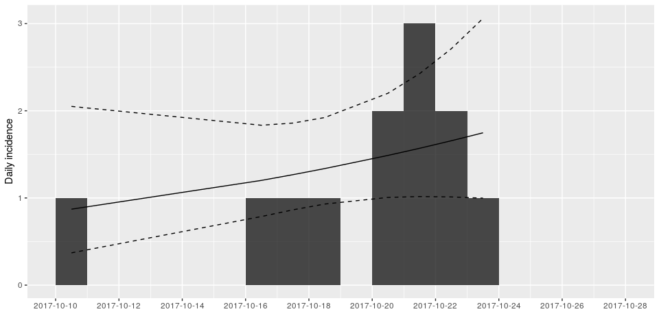
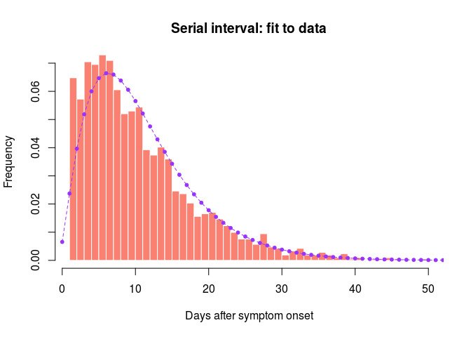
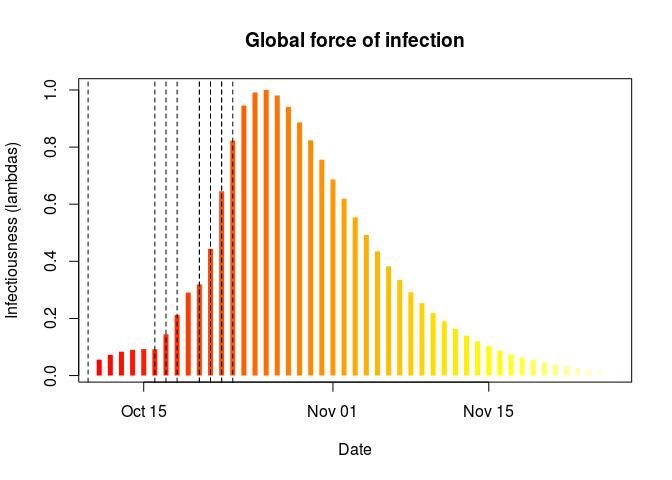
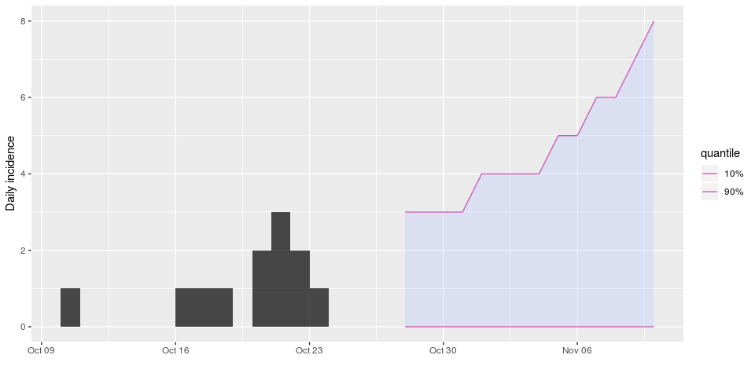

This practical simulates the early assessment and reconstruction of an
Ebola Virus Disease (EVD) outbreak. It introduces various aspects of
analysis of the early stage of an outbreak, including contact tracing
data, epicurves, growth rate estimation from log-linear models, and more
refined estimates of transmissibility. A follow-up practical will
provide an introduction to transmission chain reconstruction using
*outbreaker2*.

<br>

A novel EVD outbreak in Ankh, Republic of Morporkia
===================================================

A new EVD outbreak has been notified in the small city of Ankh, located
in the Northern, rural district of the Republic of Morporkia. Public
Health Morporkia (PHM) is in charge of coordinating the outbreak
response, and have contracted you as a consultant in epidemics analysis
to inform the response in real time.

Required packages
-----------------

The following packages, available on CRAN, are needed for this case
study:

-   [`xlsx`](https://cran.r-project.org/web/packages/xlsx/index.html) to
    read `.xlsx` files
-   [`outbreaks`](http://www.repidemicsconsortium.org/outbreaks/) for
    some other outbreak data
-   [`incidence`](http://www.repidemicsconsortium.org/incidence/) for
    epicurves
-   [`epicontacts`](http://www.repidemicsconsortium.org/epicontacts/)
    for contact data visualisation
-   [`distcrete`](http://www.repidemicsconsortium.org/distcrete) to
    obtain discretised delay distributions
-   [`epitrix`](http://www.repidemicsconsortium.org/epitrix) to fit
    discretised Gamma distributions
-   [`earlyR`](http://www.repidemicsconsortium.org/earlyR) to estimate
    *R*<sub>0</sub>
-   [`projections`](http://www.repidemicsconsortium.org/projections) for
    short term forecasting

To install these packages, use `install.packages`, e.g.:

``` r
install.packages("xlsx")
install.packages("outbreaks")
install.packages("incidence")
install.packages("epicontacts")
install.packages("distcrete")
install.packages("epitrix")
install.packages("earlyR")
install.packages("projections")
```

Early data
----------

While a new data update is pending, you have been given the following
linelist and contact data, from the early stages of the outbreak:

-   [PHM-EVD-linelist-2017-10-27.xlsx](../../data/PHM-EVD-linelist-2017-10-27.xlsx):
    a linelist containing case information up to the 27th October 2017

-   [PHM-EVD-contacts-2017-10-27.xlsx](../../data/PHM-EVD-contacts-2017-10-27.xlsx):
    a list of contacts reported between cases up to the 27th October
    2017, where `from` indicates a potential source of infection, and
    `to` the recipient of the contact.

To read into R, download these files and use the function `read.xlsx()`
from the `xlsx` package to import the data. Each import will create a
`data.frame`. Call the first one `linelist`, and the second one
`contacts`. For instance, you first command line could look like:

``` r
linelist <- xlsx::read.xlsx("PHM-EVD-linelist-2017-10-27.xlsx", sheetIndex = 1)
```

Once imported, the data should look like:

``` r

## linelist: one line per case
linelist
##        id      onset    sex age
## 1  39e9dc 2017-10-10 female  62
## 2  664549 2017-10-16   male  28
## 3  b4d8aa 2017-10-17   male  54
## 4  51883d 2017-10-18   male  57
## 5  947e40 2017-10-20 female  23
## 6  9aa197 2017-10-20 female  66
## 7  e4b0a2 2017-10-21 female  13
## 8  af0ac0 2017-10-21   male  10
## 9  185911 2017-10-21 female  34
## 10 601d2e 2017-10-22   male  11
## 11 605322 2017-10-22 female  23
## 12 e399b1 2017-10-23 female  23

## contacts: pairs of cases with reported contacts
contacts
##      from     to
## 1  51883d 185911
## 2  b4d8aa e4b0a2
## 3  39e9dc b4d8aa
## 4  39e9dc 601d2e
## 5  51883d 9aa197
## 6  39e9dc 51883d
## 7  39e9dc e399b1
## 8  b4d8aa af0ac0
## 9  39e9dc 947e40
## 10 39e9dc 664549
## 11 39e9dc 605322
```

Descriptive analyses
====================

A first look at contacts
------------------------

Contact tracing is at the centre of an Ebola outbreak response. Using
the function `make_epicontacts` in the `epicontacts` package, create a
new `epicontacts` object called `x`. The result should look like:

``` r
x
## 
## /// Epidemiological Contacts //
## 
##   // class: epicontacts
##   // 12 cases in linelist; 11 contacts;  directed 
## 
##   // linelist
## 
## # A tibble: 12 x 4
##    id     onset      sex      age
##  * <chr>  <date>     <fct>  <dbl>
##  1 39e9dc 2017-10-10 female   62.
##  2 664549 2017-10-16 male     28.
##  3 b4d8aa 2017-10-17 male     54.
##  4 51883d 2017-10-18 male     57.
##  5 947e40 2017-10-20 female   23.
##  6 9aa197 2017-10-20 female   66.
##  7 e4b0a2 2017-10-21 female   13.
##  8 af0ac0 2017-10-21 male     10.
##  9 185911 2017-10-21 female   34.
## 10 601d2e 2017-10-22 male     11.
## 11 605322 2017-10-22 female   23.
## 12 e399b1 2017-10-23 female   23.
## 
##   // contacts
## 
## # A tibble: 11 x 2
##    from   to    
##    <chr>  <chr> 
##  1 51883d 185911
##  2 b4d8aa e4b0a2
##  3 39e9dc b4d8aa
##  4 39e9dc 601d2e
##  5 51883d 9aa197
##  6 39e9dc 51883d
##  7 39e9dc e399b1
##  8 b4d8aa af0ac0
##  9 39e9dc 947e40
## 10 39e9dc 664549
## 11 39e9dc 605322
```

You can easily plot these contacts, but with a little bit of tweaking
(see `?vis_epicontacts`) you can customise shapes by gender:

``` r
plot(x, node_shape = "sex", shapes = c(male = "male", female = "female"), selector = FALSE)
```


<font class="question">What can you say about these contacts?</font>

Looking at incidence curves
---------------------------

The first question PHM asks you is simply: *how bad is it?*. Given that
this is a terrible disease, with a mortality rate nearing 70%, there is
a lot of concern about this outbreak getting out of control. The first
step of the analysis lies in drawing an *epicurve*, i.e. an plot of
incidence over time.

<br>

Using the package `incidence`, compute daily incidence based on the
dates of symptom onset. Store the result in an object called `i`; the
result should look like:

``` r
i
## <incidence object>
## [12 cases from days 2017-10-10 to 2017-10-23]
## 
## $counts: matrix with 14 rows and 1 columns
## $n: 12 cases in total
## $dates: 14 dates marking the left-side of bins
## $interval: 1 day
## $timespan: 14 days
plot(i)
```



If you pay close attention to the dates on the x-axis, you may notice
that something is missing. Indeed, the graph stops right after the last
case, while the data should be complete until the 27th October 2017. You
can remedy this using the argument `last_date` in the `incidence`
function:

``` r
i <- incidence(linelist$onset, last_date = as.Date("2017-10-27"))
i
## <incidence object>
## [12 cases from days 2017-10-10 to 2017-10-27]
## 
## $counts: matrix with 18 rows and 1 columns
## $n: 12 cases in total
## $dates: 18 dates marking the left-side of bins
## $interval: 1 day
## $timespan: 18 days
plot(i)
```



Statistical analyses
====================

Log-linear model
----------------

The simplest model of incidence is probably the log-linear model, i.e. a
linear regression on log-transformed incidences. In the `incidence`
package, the function `fit` will estimate the parameters of this model
from an incidence object (here, `i`). Apply it to the data and store the
result in a new object called `f`. You can print `f` to derive estimates
of the growth rate *r* and the doubling time, and add the corresponding
model to the incidence plot:

``` r
f <- fit(i)
## Warning in fit(i): 10 dates with incidence of 0 ignored for fitting
f
## <incidence_fit object>
## 
## $lm: regression of log-incidence over time
## 
## $info: list containing the following items:
##   $r (daily growth rate):
## [1] 0.05352107
## 
##   $r.conf (confidence interval):
##           2.5 %    97.5 %
## [1,] -0.0390633 0.1461054
## 
##   $doubling (doubling time in days):
## [1] 12.95092
## 
##   $doubling.conf (confidence interval):
##         2.5 %    97.5 %
## [1,] 4.744158 -17.74421
## 
##   $pred: data.frame of incidence predictions (8 rows, 5 columns)
plot(i, fit = f)
```



<font class="question">How would you interpret this result?What
criticism would you make on this model?</font>

<!-- As an aid for interpretation, you are reminded of previous observations of the -->
<!-- serial interval distribution, estimated during the West African EVD outbreak -->
<!-- (WHO Ebola Response Team (2014) NEJM 371:1481–1495) with a mean of 15.3 days and -->
<!-- a standard deviation 9.3 days. -->
Estimation of transmissibility (*R*)
------------------------------------

### Branching process model

The transmissibility of the disease can be assessed through the
estimation of the reproduction number *R*, defined as the number of
expected secondary cases per infected case. In the early stages of an
outbreak, and assuming no immunity in the population, this quantity is
also the basic reproduction number *R*<sub>0</sub>, i.e. *R* in a fully
susceptible population.

<br>

The package `earlyR` implements a simple maximum-likelihood estimation
of *R*, using dates of onset of symptoms and information on the serial
interval distribution. It is a simpler but less flexible version of the
model by Cori et al (2013, AJE 178: 1505–1512) implemented in
[`EpiEstim`](https://cran.r-project.org/web/packages/EpiEstim/index.html).

<br>

Briefly, `earlyR` uses a simple model describing incidence on a given
day as a Poisson process determined by a global force of infection on
that day:
*x*<sub>*t*</sub> ∼ 𝒫(*λ*<sub>*t*</sub>)

where *x*<sub>*t*</sub> is the incidence (based on symptom onset) on day
*t* and *λ*<sub>*t*</sub> is the force of infection. Noting *R* the
reproduction number and *w*() the discrete serial interval distribution,
we have:

$$
\\lambda\_t = R \* \\sum\_{s=1}^t x\_s w(t - s)
$$

The likelihood (probability of observing the data given the model and
parameters) is defined as a function of *R*:

$$
\\mathcal{L}(x)  = p(x \| R) = \\prod\_{t=1}^T F\_{\\mathcal{P}}(x\_t, \\lambda\_t)
$$

where *F*<sub>𝒫</sub> is the Poisson probability mass function.

### Estimating the serial interval from older data

As current data are insufficient to estimate the serial interval
distribution, some colleague recommends using data from a past outbreak
stored in the `outbreaks` package, as the dataset `ebola_sim_clean`.
Load this dataset, and create a new `epicontacts` object as before,
without plotting it (it is a much larger dataset). Store the new object
as `old_evd`; the output should look like:

``` r
old_evd
## 
## /// Epidemiological Contacts //
## 
##   // class: epicontacts
##   // 5,829 cases in linelist; 3,800 contacts;  directed 
## 
##   // linelist
## 
## # A tibble: 5,829 x 9
##    id     generation date_of_infection date_of_onset date_of_hospitalisat~
##  * <chr>       <int> <date>            <date>        <date>               
##  1 d1fafd          0 NA                2014-04-07    2014-04-17           
##  2 53371b          1 2014-04-09        2014-04-15    2014-04-20           
##  3 f5c3d8          1 2014-04-18        2014-04-21    2014-04-25           
##  4 6c286a          2 NA                2014-04-27    2014-04-27           
##  5 0f58c4          2 2014-04-22        2014-04-26    2014-04-29           
##  6 49731d          0 2014-03-19        2014-04-25    2014-05-02           
##  7 f9149b          3 NA                2014-05-03    2014-05-04           
##  8 881bd4          3 2014-04-26        2014-05-01    2014-05-05           
##  9 e66fa4          2 NA                2014-04-21    2014-05-06           
## 10 20b688          3 NA                2014-05-05    2014-05-06           
## # ... with 5,819 more rows, and 4 more variables: date_of_outcome <date>,
## #   outcome <fct>, gender <fct>, hospital <fct>
## 
##   // contacts
## 
## # A tibble: 3,800 x 3
##    from   to     source 
##  * <chr>  <chr>  <fct>  
##  1 d1fafd 53371b other  
##  2 cac51e f5c3d8 funeral
##  3 f5c3d8 0f58c4 other  
##  4 0f58c4 881bd4 other  
##  5 8508df 40ae5f other  
##  6 127d83 f547d6 funeral
##  7 f5c3d8 d58402 other  
##  8 20b688 d8a13d other  
##  9 2ae019 a3c8b8 other  
## 10 20b688 974bc1 other  
## # ... with 3,790 more rows
```

The function `get_pairwise` can be used to extract pairwise features of
contacts based on attributes of the linelist. For instance, it could be
used to test for assortativity, but also to compute delays between
connected cases. Here, we use it to extract the serial interval:

``` r
old_si <- get_pairwise(old_evd, "date_of_onset")
summary(old_si)
##    Min. 1st Qu.  Median    Mean 3rd Qu.    Max.    NA's 
##    1.00    5.00    9.00   11.06   15.00   99.00    1684
old_si <- na.omit(old_si)
summary(old_si)
##    Min. 1st Qu.  Median    Mean 3rd Qu.    Max. 
##    1.00    5.00    9.00   11.06   15.00   99.00
hist(old_si, xlab = "Days after symptom onset", ylab = "Frequency",
     main = "Serial interval (empirical distribution)",
     col = "grey", border = "white")
```


<font class="question">What do you think of this distribution?</font>
Make the adjustments you deem necessary, and then use the function
`fit_disc_gamma` from the package `epitrix` to fit a discretised Gamma
distribution to these data. Your results should approximately look like:

``` r
si_fit <- fit_disc_gamma(old_si)
si_fit
## $mu
## [1] 11.48373
## 
## $cv
## [1] 0.6429561
## 
## $sd
## [1] 7.383534
## 
## $ll
## [1] -6905.588
## 
## $converged
## [1] TRUE
## 
## $distribution
## A discrete distribution
##   name: gamma
##   parameters:
##     shape: 2.41900859135364
##     scale: 4.74728799288241
```

Now that you know how to parametrise a discretised Gamma distribution
matching previous data on the serial interval, create this distribution
using the function `distcrete` from the similarly named package. Specify
make sure you use daily intervals for the discretisation, and use
`w = 0` to indicate dates should be floored to the day. Store the ouput
in an object called `si`. Your results should look like:

    ## Warning: package 'distcrete' was built under R version 3.4.4
    si
    ## A discrete distribution
    ##   name: gamma
    ##   parameters:
    ##     shape: 2.41900859135364
    ##     scale: 4.74728799288241

    ## look at the fit
    hist(old_si, xlab = "Days after symptom onset", ylab = "Frequency",
         main = "Serial interval: fit to data", col = "grey", border = "white",
         nclass = 30, ylim = c(0, 0.07), prob = TRUE)
    points(0:60, si$d(0:60), col = "#9933ff", pch = 20)
    points(0:60, si$d(0:60), col = "#9933ff", type = "l", lty = 2)



<font class="question">Would you trust this estimation of the generation
time?</font> <font class="question">How would you compare it to actual
estimates from the West African EVD outbreak (WHO Ebola Response Team
(2014) NEJM 371:1481–1495) with a mean of 15.3 days and a standard
deviation 9.3 days?</font>

### Estimation of *R*<sub>0</sub>

Using the estimates of the mean and standard deviation of the serial
interval you just obtained, use the function `get_R` to estimate the
reproduction number, specifying a maximum R of 10 (see ?`get_R`) and
store the result in a new object `R`:

You can visualise the results as follows:

``` r
R
## 
## /// Early estimate of reproduction number (R) //
##  // class: earlyR, list
## 
##  // Maximum-Likelihood estimate of R ($R_ml):
## [1] 1.811812
## 
## 
##  // $lambda:
##   0.04088711 0.05343783 0.06188455 0.06668495 0.06850099 0.0680082...
## 
##  // $dates:
## [1] "2017-10-11" "2017-10-12" "2017-10-13" "2017-10-14" "2017-10-15"
## [6] "2017-10-16"
## ...
## 
##  // $si (serial interval):
## A discrete distribution
##   name: gamma
##   parameters:
##     shape: 2.41900859135364
##     scale: 4.74728799288241
plot(R)
```


``` r
plot(R, "lambdas")
abline(v = linelist$onset, lty = 2)
```



The first figure shows the distribution of likely values of *R*, and the
Maximum-Likelihood (ML) estimation. The second figure shows the global
force of infection over time, with dashed bars indicating dates of onset
of the cases.

<font class="question">Interpret these results: what do you make of the
reproduction number?What does it reflect? Based on the last part of the
epicurve, some colleagues suggest that incidence is going down and the
outbreak may be under control. What is your opinion on this?</font>

Short-term forecasting
----------------------

The function `project` from the package `projections` can be used to
simulate plausible epidemic trajectories by simulating daily incidence
using the same branching process as the one used to estimate
*R*<sub>0</sub> in `earlyR`. All that is needed is one or several values
of *R*<sub>0</sub> and a serial interval distribution, stored as a
`distcrete` object.

Here, we illustrate how we can simulate 5 random trajectories using a
fixed value of $R\_0 = $1.81, the ML estimate of *R*<sub>0</sub>:

``` r
library(projections)
## Warning: package 'projections' was built under R version 3.4.4
project(i, R = R$R_ml, si = si, n_sim = 5, n_days = 10, R_fix_within = TRUE)
## 
## /// Incidence projections //
## 
##   // class: projections, matrix
##   // 10 dates (rows); 5 simulations (columns)
## 
##  // first rows/columns:
##            [,1] [,2] [,3] [,4] [,5]
## 2017-10-28    0    2    0    0    0
## 2017-10-29    1    0    1    1    0
## 2017-10-30    1    2    0    4    1
## 2017-10-31    0    1    0    0    0
##  .
##  .
##  .
## 
##  // dates:
##  [1] "2017-10-28" "2017-10-29" "2017-10-30" "2017-10-31" "2017-11-01"
##  [6] "2017-11-02" "2017-11-03" "2017-11-04" "2017-11-05" "2017-11-06"
```

Using the same principle, generate 1,000 trajectories for the next 2
weeks, using a range of plausible values of *R*<sub>0</sub>. Note that
you can use `sample_R` to obtain these values from your `earlyR` object.
Store your results in an object called `proj`. Plotting the results
should give something akin to:

``` r
plot(proj, c(.1,.9))
```



Interpret the following summary:

``` r
apply(proj, 1, summary)
##         2017-10-28 2017-10-29 2017-10-30 2017-10-31 2017-11-01 2017-11-02
## Min.         0.000      0.000      0.000      0.000      0.000      0.000
## 1st Qu.      0.000      0.000      0.000      0.000      1.000      1.000
## Median       1.000      1.000      1.000      1.000      1.000      1.000
## Mean         1.403      1.457      1.518      1.494      1.651      1.771
## 3rd Qu.      2.000      2.000      2.000      2.000      2.000      3.000
## Max.         7.000      6.000      8.000     10.000     10.000     13.000
##         2017-11-03 2017-11-04 2017-11-05 2017-11-06 2017-11-07 2017-11-08
## Min.         0.000      0.000      0.000       0.00      0.000      0.000
## 1st Qu.      1.000      1.000      1.000       1.00      1.000      1.000
## Median       2.000      2.000      2.000       2.00      2.000      2.000
## Mean         1.905      2.046      2.313       2.42      2.663      2.942
## 3rd Qu.      3.000      3.000      3.000       3.00      4.000      4.000
## Max.        12.000     11.000     25.000      26.00     27.000     20.000
##         2017-11-09 2017-11-10
## Min.         0.000      0.000
## 1st Qu.      1.000      1.000
## Median       2.000      3.000
## Mean         3.144      3.606
## 3rd Qu.      4.000      5.000
## Max.        25.000     27.000
apply(proj, 1, function(x) mean(x>0))
## 2017-10-28 2017-10-29 2017-10-30 2017-10-31 2017-11-01 2017-11-02 
##      0.742      0.742      0.741      0.738      0.781      0.771 
## 2017-11-03 2017-11-04 2017-11-05 2017-11-06 2017-11-07 2017-11-08 
##      0.808      0.808      0.809      0.816      0.824      0.850 
## 2017-11-09 2017-11-10 
##      0.859      0.877
```

<font class="question">According to these results, what are the chances
that more cases will appear in the near
future?</font><font class="question">Is this outbreak being brought
under control?</font> <font class="question">Would you recommend scaling
up / down the response?</font>

Follow-up…
----------

For a follow-up on this outbreak, have a look at the [second
part](../simulated-evd-reconstruction) of this simulated response, which
includes a data update, genetic sequences, and the use of outbreak
reconstruction tools.

About this document
===================

Contributors
------------

-   Thibaut Jombart: initial version

Contributions are welcome via [pull
requests](https://github.com/reconhub/learn/pulls). The source file is
hosted on
[github](https://github.com/reconhub/learn/blob/master/content/post/2017-11-21-sim-ebola-response-early.Rmd).

Legal stuff
-----------

**License**: [CC-BY](https://creativecommons.org/licenses/by/3.0/)
**Copyright**: Thibaut Jombart, 2017
