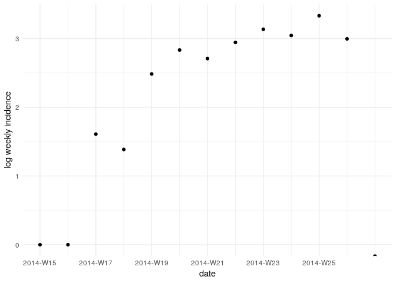
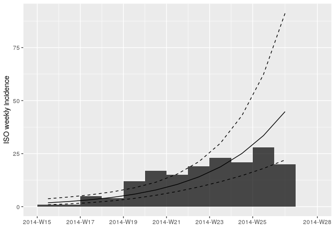
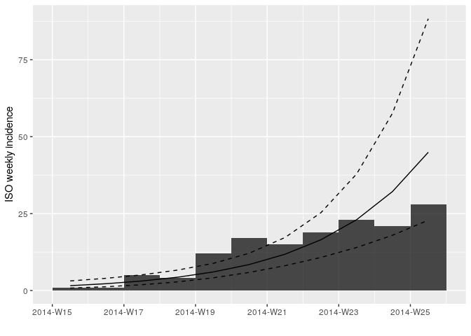
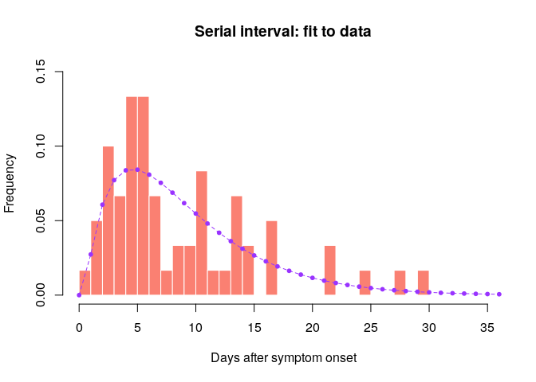
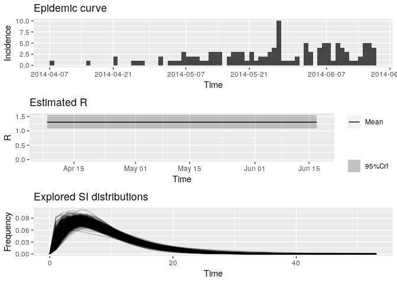
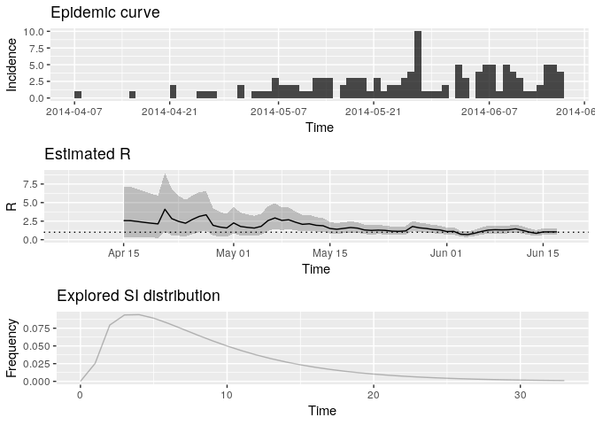

## Introduction

This practical is the second (out of three) part of a practical which
simulates the early assessment and reconstruction of an Ebola Virus
Disease (EVD) outbreak. Please make sure you have gone through [part
1](./real-time-response-1.html) before starting [part
2](./real-time-response-2.html). In [part
2](./real-time-response-2.html) of the practical, we introduce various
aspects of analysis of the early stage of an outbreak, including growth
rate estimation, contact tracing data, delays, and estimates of
transmissibility. Part 3 of the practical will give an introduction to
transmission chain reconstruction using outbreaker2.

> Note: This practical is derived from earlier practicals called [Ebola
> simulation part 1: early outbreak
> assessment](./simulated-evd-early.html) and [Ebola simulation part 2:
> outbreak reconstruction](./practical-ebola-reconstruction.html)

## Learning outcomes

By the end of this practical ([part 2](./real-time-response-2.html)),
you should be able to:

  - Estimate & interpret the growth rate & doubling time of the epidemic

  - Estimate the serial interval from data on pairs infector / infected
    individuals

  - Estimate & interpret the reproduction number of the epidemic

  - Forecast short-term future incidence

## Context: A novel EVD outbreak in a fictional country in West Africa

A new EVD outbreak has been notified in a fictional country in West
Africa. The Ministry of Health is in charge of coordinating the outbreak
response, and have contracted you as a consultant in epidemic analysis
to inform the response in real time. You have already read in an done
descriptive analysis of the data ([part 1](./real-time-response-1.html)
of the practical). Now let’s do some statistical analyses\!

## Required packages

The following packages, available on CRAN or github, are needed for this
analysis. You should have installed them in [part
1](./real-time-response-1.html) but if not, install necessary packages
as follows:

``` r
# install.packages("remotes")
# install.packages("readxl")
# install.packages("outbreaks")
# install.packages("incidence")
# remotes::install_github("reconhub/epicontacts@ttree")
# install.packages("distcrete")
# install.packages("epitrix")
# remotes::install_github("annecori/EpiEstim")
# remotes::install_github("reconhub/projections")
# install.packages("ggplot2")
# install.packages("magrittr")
# install.packages("binom")
# install.packages("ape")
# install.packages("outbreaker2")
# install.packages("here")
```

Once the packages are installed, you may need to open a new R session.
Then load the libraries as follows:

``` r
library(readxl)
library(outbreaks)
library(incidence)
library(epicontacts)
library(distcrete)
library(epitrix)
library(EpiEstim)
library(projections)
library(ggplot2)
library(magrittr)
library(binom)
library(ape)
library(outbreaker2)
library(here)
```

## Read in the data processed in [part 1](./real-time-response-1.html)

<!--
ZNK: These two chunks are needed because of the way the documents are structured
in blogdown. The source that we edit is not the same as the site that is
rendered. Everything in this directory will end up in the same directory as the
"static" when the website is displayed, but the current directory structure is
present when the practicals are built, so we have to do this silly 
song-and-dance to appease the directory gods.
-->

``` r
i_daily <- readRDS(here("data/clean/i_daily.rds"))
i_weekly <- readRDS(here("data/clean/i_weekly.rds"))
linelist <- readRDS(here("data/clean/linelist.rds"))
linelist_clean <- readRDS(here("data/clean/linelist_clean.rds"))
contacts <- readRDS(here("data/clean/contacts.rds"))
```

## Estimating the growth rate using a log-linear model

The simplest model of incidence is probably the log-linear model, i.e. a
linear regression on log-transformed incidences. For this we will work
with weekly incidence, to avoid having too many issues with zero
incidence (which cannot be logged).

Visualise the log-transformed incidence:

``` r
ggplot(as.data.frame(i_weekly)) + 
  geom_point(aes(x = dates, y = log(counts))) + 
  scale_x_incidence(i_weekly) +
  xlab("date") +
  ylab("log weekly incidence") + 
  theme_minimal()
```

<!-- -->

What does this plot tell you about the epidemic?

In the `incidence` package, the function `fit` will estimate the
parameters of this model from an incidence object (here, `i_weekly`).
Apply it to the data and store the result in a new object called `f`.
You can print and use `f` to derive estimates of the growth rate r and
the doubling time, and add the corresponding model to the incidence
plot:

Fit a log-linear model to the weekly incidence
    data:

``` r
f <- incidence::fit(i_weekly)
```

    ## Warning in incidence::fit(i_weekly): 1 dates with incidence of 0 ignored
    ## for fitting

``` r
f
```

    ## <incidence_fit object>
    ## 
    ## $model: regression of log-incidence over time
    ## 
    ## $info: list containing the following items:
    ##   $r (daily growth rate):
    ## [1] 0.04145251
    ## 
    ##   $r.conf (confidence interval):
    ##           2.5 %     97.5 %
    ## [1,] 0.02582225 0.05708276
    ## 
    ##   $doubling (doubling time in days):
    ## [1] 16.72148
    ## 
    ##   $doubling.conf (confidence interval):
    ##         2.5 %   97.5 %
    ## [1,] 12.14285 26.84302
    ## 
    ##   $pred: data.frame of incidence predictions (12 rows, 5 columns)

``` r
plot(i_weekly, fit = f)
```

<!-- -->

Looking at the plot and fit, do you think this is a reasonable
fit?

## Finding a suitable threshold date for the log-linear model, based on the observed delays

Using the plot of the log(incidence) that you plotted above, and
thinking about why exponential growth may not be observed in the most
recent weeks, choose a threshold date and fit the log-linear model to a
suitable section of the epicurve where you think we can more reliably
estimate the growth rate, r, and the doubling time.

You may want to examine how long after onset of symptoms cases are
hospitalised; this may inform the threshold date you choose, as
follows:

``` r
summary(as.numeric(linelist_clean$date_of_hospitalisation - linelist_clean$date_of_onset))
```

    ##    Min. 1st Qu.  Median    Mean 3rd Qu.    Max. 
    ##    0.00    1.00    2.00    3.53    5.00   22.00

``` r
# how many weeks should we discard at the end of the epicurve
n_weeks_to_discard <- 
```

``` r
min_date <- min(i_daily$dates)
max_date <- max(i_daily$dates) - n_weeks_to_discard * 7
# weekly truncated incidence
i_weekly_trunc <- subset(i_weekly, 
                         from = min_date, 
                         to = max_date) # discard last few weeks of data
# daily truncated incidence (not used for the linear regression but may be used later)
i_daily_trunc <- subset(i_daily, 
                         from = min_date, 
                         to = max_date) # remove last two weeks of data
```

Refit and plot your log-linear model as before but using the truncated
data `i_weekly_trunc`.

    ## <incidence_fit object>
    ## 
    ## $model: regression of log-incidence over time
    ## 
    ## $info: list containing the following items:
    ##   $r (daily growth rate):
    ## [1] 0.04773599
    ## 
    ##   $r.conf (confidence interval):
    ##           2.5 %     97.5 %
    ## [1,] 0.03141233 0.06405965
    ## 
    ##   $doubling (doubling time in days):
    ## [1] 14.52043
    ## 
    ##   $doubling.conf (confidence interval):
    ##         2.5 %   97.5 %
    ## [1,] 10.82034 22.06609
    ## 
    ##   $pred: data.frame of incidence predictions (11 rows, 5 columns)

<!-- -->

Look at the summary statistics of your fit:

``` r
summary(f$model)
```

    ## 
    ## Call:
    ## stats::lm(formula = log(counts) ~ dates.x, data = df)
    ## 
    ## Residuals:
    ##      Min       1Q   Median       3Q      Max 
    ## -0.79781 -0.44508 -0.00138  0.35848  0.69880 
    ## 
    ## Coefficients:
    ##             Estimate Std. Error t value Pr(>|t|)    
    ## (Intercept) 0.296579   0.320461   0.925    0.379    
    ## dates.x     0.047736   0.007216   6.615 9.75e-05 ***
    ## ---
    ## Signif. codes:  0 '***' 0.001 '**' 0.01 '*' 0.05 '.' 0.1 ' ' 1
    ## 
    ## Residual standard error: 0.5298 on 9 degrees of freedom
    ## Multiple R-squared:  0.8294, Adjusted R-squared:  0.8105 
    ## F-statistic: 43.76 on 1 and 9 DF,  p-value: 9.754e-05

You can look at the goodness of fit (Rsquared), the estimated slope
(growth rate) and the corresponding doubling time as below:

``` r
# does the model fit the data well? 
adjRsq_model_fit <- summary(f$model)$adj.r.squared
# what is the estimated growth rate of the epidemic?
daily_growth_rate <- f$model$coefficients['dates.x']
# confidence interval:
daily_growth_rate_CI <- confint(f$model, 'dates.x', level=0.95)
# what is the doubling time of the epidemic? 
doubling_time_days <- log(2) / daily_growth_rate
# confidence interval:
doubling_time_days_CI <- log(2) / rev(daily_growth_rate_CI)
```

Although the log-linear is a simple and quick method for early epidemic
assessment, care must be taken to only fit to the point that there is
epidemic growth. Note that it may be difficult to define this point.

## Contact Tracing - Looking at contacts

Contact tracing is one of the pillars of an Ebola outbreak response.
This involves identifying and following up any at risk individuals who
have had contact with a known case (i.e. may have been infected). For
Ebola, contacts are followed up for 21 days (the upper bound of the
incubation period). This ensures that contacts who become symptomatic
can be isolated quickly, reducing the chance of further transmission. We
use the full linelist here rather than `linelist_clean` where we
discarded entries with errors in the dates. However, the contact may
still be valid.

Using the function `make_epicontacts` in the `epicontacts` package,
create a new `epicontacts` object called `epi_contacts`. Make sure you
check the column names of the relevant `to` and `from` arguments.

``` r
epi_contacts
```

    ## 
    ## /// Epidemiological Contacts //
    ## 
    ##   // class: epicontacts
    ##   // 169 cases in linelist; 60 contacts;  directed 
    ## 
    ##   // linelist
    ## 
    ## # A tibble: 169 x 11
    ##    id    generation date_of_infecti… date_of_onset date_of_hospita…
    ##    <chr>      <dbl> <date>           <date>        <date>          
    ##  1 d1fa…          0 NA               2014-04-07    2014-04-17      
    ##  2 5337…          1 2014-04-09       2014-04-15    2014-04-20      
    ##  3 f5c3…          1 2014-04-18       2014-04-21    2014-04-25      
    ##  4 6c28…          2 NA               2014-04-27    2014-04-27      
    ##  5 0f58…          2 2014-04-22       2014-04-26    2014-04-29      
    ##  6 4973…          0 2014-03-19       2014-04-25    2014-05-02      
    ##  7 f914…          3 NA               2014-05-03    2014-05-04      
    ##  8 881b…          3 2014-04-26       2014-05-01    2014-05-05      
    ##  9 e66f…          2 NA               2014-04-21    2014-05-06      
    ## 10 20b6…          3 NA               2014-05-05    2014-05-06      
    ## # … with 159 more rows, and 6 more variables: date_of_outcome <date>,
    ## #   outcome <chr>, gender <chr>, hospital <chr>, lon <dbl>, lat <dbl>
    ## 
    ##   // contacts
    ## 
    ## # A tibble: 60 x 3
    ##    from   to     source 
    ##    <chr>  <chr>  <chr>  
    ##  1 d1fafd 53371b other  
    ##  2 f5c3d8 0f58c4 other  
    ##  3 0f58c4 881bd4 other  
    ##  4 f5c3d8 d58402 other  
    ##  5 20b688 d8a13d funeral
    ##  6 2ae019 a3c8b8 other  
    ##  7 20b688 974bc1 funeral
    ##  8 2ae019 72b905 funeral
    ##  9 40ae5f b8f2fd funeral
    ## 10 f1f60f 09e386 other  
    ## # … with 50 more rows

You can easily plot these contacts, but with a little bit of tweaking
(see `?vis_epicontacts`) you can customise for example shapes by gender
and arrow colours by source of exposure (or other variables of
interest):

``` r
# for example, look at the reported source of infection of the contacts.
table(epi_contacts$contacts$source, useNA = "ifany")
```

    ## 
    ## funeral   other 
    ##      20      40

``` r
p <- plot(epi_contacts, node_shape = "gender", shapes = c(m = "male", f = "female"), node_color = "gender", edge_color = "source", selector = FALSE)
p
```

<!--html_preserve-->

<iframe src="widgets/real-time-response-2-nework.html" width="100%" height="500px">

</iframe>

<!--/html_preserve-->

Using the function `match` (see `?match`) check that the visualised
contacts are indeed
    cases.

    ##  [1]   2   5   8  14  15  16  18  20  21  22  24  25  26  27  30  33  37
    ## [18]  38  40  46  48  51  58  59  62  64  68  69  70  71  73  75  79  84
    ## [35]  86  88  90  94  95  96  98 103 108 115 116 122 126 131 133 142 145
    ## [52] 146 147 148 153 155 157 160 162 166

Once you are happy that these are all indeed cases, look at the network:

  - does it look like there is super-spreading (heterogeneous
    transmission)?
  - looking at the gender of the cases, can you deduce anything from
    this? Are there any visible differences by gender?

## Estimating transmissibility (`$R$`)

### Branching process model

The transmissibility of the disease can be assessed through the
estimation of the reproduction number R, defined as the expected number
of secondary cases per infected case. In the early stages of an
outbreak, and assuming a large population with no immunity, this
quantity is also the basic reproduction number `$R_0$`, i.e. `$R$` in a
large fully susceptible population.

The package `EpiEstim` implements a Bayesian estimation of `$R$`, using
dates of onset of symptoms and information on the serial interval
distribution, i.e. the distribution of time from symptom onset in a case
and symptom onset in their infector (see Cori et al., 2013, AJE 178:
1505–1512).

Briefly, `EpiEstim` uses a simple model describing incidence on a given
day as Poisson distributed, with a mean determined by the total force of
infection on that day:

`$$ I_t  ∼  Poisson(\lambda_t)$$`

where `$I_t$` is the incidence (based on symptom onset) on day `$t$` and
`$\lambda_t$` is the force of infection on that day. Noting R the
reproduction number and w() the discrete serial interval distribution,
we have:

`$$\lambda_t = R \sum_{s=1}^t I_sw(t-s)$$`

The likelihood (probability of observing the data given the model and
parameters) is defined as a function of R:

`$$L(I) = p(I|R) = \prod_{t = 1}^{T} f_P(I_t, \lambda_t)$$`

where `$f_P(.,\mu)$` is the probability mass function of a Poisson
distribution with mean `$\mu$`.

### Estimating the serial interval

As data was collected on pairs of infector and infected individuals,
this should be sufficient to estimate the serial interval distribution.
If that was not the case, we could have used data from past outbreaks
instead.

Use the function `get_pairwise` can be used to extract the serial
interval (i.e. the difference in date of onset between infectors and
infected individuals):

``` r
si_obs <- get_pairwise(epi_contacts, "date_of_onset")
summary(si_obs)
```

    ##    Min. 1st Qu.  Median    Mean 3rd Qu.    Max. 
    ##   1.000   5.000   6.500   9.117  12.250  30.000

``` r
## Min. 1st Qu.  Median    Mean 3rd Qu.    Max. 
## 1.000   5.000   6.500   9.117  12.250  30.000 
hist(si_obs, breaks = 0:30,
     xlab = "Days after symptom onset", ylab = "Frequency",
     main = "Serial interval (empirical distribution)",
     col = "grey", border = "white")
```

<!-- -->

What do you think of this distribution? Make any adjustment you would
deem necessary, and then use the function `fit_disc_gamma` from the
package `epitrix` to fit a discretised Gamma distribution to these data.
Your results should approximately look like:

``` r
si_fit <- fit_disc_gamma(si_obs, w = 1)
si_fit
```

    ## $mu
    ## [1] 8.612892
    ## 
    ## $cv
    ## [1] 0.7277355
    ## 
    ## $sd
    ## [1] 6.267907
    ## 
    ## $ll
    ## [1] -183.4215
    ## 
    ## $converged
    ## [1] TRUE
    ## 
    ## $distribution
    ## A discrete distribution
    ##   name: gamma
    ##   parameters:
    ##     shape: 1.88822148063956
    ##     scale: 4.5613778865727

`si_fit` contains various information about the fitted delays, including
the estimated distribution in the `$distribution` slot. You can compare
this distribution to the empirical data in the following plot:

``` r
si <- si_fit$distribution
si
```

    ## A discrete distribution
    ##   name: gamma
    ##   parameters:
    ##     shape: 1.88822148063956
    ##     scale: 4.5613778865727

``` r
## compare fitted distribution
hist(si_obs, xlab = "Days after symptom onset", ylab = "Frequency",
     main = "Serial interval: fit to data", col = "salmon", border = "white",
     50, ylim = c(0, 0.15), freq = FALSE, breaks = 0:35)
points(0:60, si$d(0:60), col = "#9933ff", pch = 20)
points(0:60, si$d(0:60), col = "#9933ff", type = "l", lty = 2)
```

<!-- -->

Would you trust this estimation of the generation time? How would you
compare it to actual estimates from the West African EVD outbreak (WHO
Ebola Response Team (2014) NEJM 371:1481–1495) with a mean of 15.3 days
and a standard deviation 9.3 days?

### Estimation of the Reproduction Number

Now that we have estimates of the serial interval, we can use this
information to estimate transmissibility of the disease (as measured by
`$R_0$`). Make sure you use a daily (not weekly) incidence object
truncated to the period where you have decided there is exponential
growth (`i_daily_trunc`).

Using the estimates of the mean and standard deviation of the serial
interval you just obtained, use the function `estimate_R` to estimate
the reproduction number (see `?estimate_R`) and store the result in a
new object `R`.

Before using `estimate_R`, you need to create a `config` object using
the `make_config` function, where you will specify the time window where
you want to estimate the reproduction number as well as the `mean_si`
and `std_si` to use. For the time window, use `t_start = 2` (you can
only estimate R from day 2 onwards as you are conditioning on the past
observed incidence) and specify `t_end = length(i_daily_trunc$counts)`
to estimate R up to the last date of your truncated incidence
`i_daily_trunc`.

``` r
config <- make_config(mean_si = si_fit$mu, # mean of the si distribution estimated earlier
                      std_si = si_fit$sd,  # standard deviation of si dist estimated earlier
                      t_start = 2,         # starting day of time window
                      t_end = length(i_daily_trunc$counts)) # final day of time window
```

``` r
R <- # use estimate_R using method = "parametric_si"
plot(R, legend = FALSE)  
```

<!-- -->

    ## TableGrob (3 x 1) "arrange": 3 grobs
    ##       z     cells    name           grob
    ## incid 1 (1-1,1-1) arrange gtable[layout]
    ## R     2 (2-2,1-1) arrange gtable[layout]
    ## SI    3 (3-3,1-1) arrange gtable[layout]

Extract the median and 95% credible intervals (95%CrI) for the
reproduction number as follows:

``` r
R_median <- R$R$`Median(R)`
R_CrI <- c(R$R$`Quantile.0.025(R)`, R$R$`Quantile.0.975(R)`)
R_median
```

    ## [1] 1.278192

``` r
R_CrI
```

    ## [1] 1.068374 1.513839

Interpret these results: what do you make of the reproduction number?
What does it reflect? Based on the last part of the epicurve, some
colleagues suggest that incidence is going down and the outbreak may be
under control. What is your opinion on this?

Note that you could have estimated R0 directly from the growth rate and
the serial interval, using the formula described in Wallinga and
Lipsitch, Proc Biol Sci, 2007: `$R_0 =
\frac{1}{\int_{s=0}^{+\infty}e^{-rs}w(s)ds}$`, and implemented in the
function `r2R0` of the `epitrix` package. Although this may seem like a
complicated formula, the reasoning behind it is simple and illustrated
in the figure below: for an observed exponentially growing incidence
curve, if you know the serial interval, you can derive the reproduction
number.


Compared to the figure above, there is uncertainty in the growth rate r,
and the serial interval has a full distribution rather than a single
value. This can be accounted for in estimating R as
follows:

``` r
# generate a sample of R0 estimates from the growth rate and serial interval we estimated above 
R_sample_from_growth_rate <- lm2R0_sample(f$model, # log-linear model which contains our estimates of the growth rate r
                                          si$d(1:100), # serial interval distribution (truncated after 100 days)
                                          n = 1000) # desired sample size
# plot these:
hist(R_sample_from_growth_rate)
```

<!-- -->

``` r
# what is the median?
R_median_from_growth_rate <- median(R_sample_from_growth_rate)
R_median_from_growth_rate # compare with R_median
```

    ## [1] 1.416124

``` r
# what is the 95%CI?
R_CI_from_growth_rate <- quantile(R_sample_from_growth_rate, c(0.025, 0.975))
R_CI_from_growth_rate # compare with R_CrI
```

    ##     2.5%    97.5% 
    ## 1.276007 1.573391

Note the above estimates are slighlty different from those obtained
using the branching process model. There are a few reasons for this.
First, you used more detailed data (daily vs weekly incidence) for the
branching process (EpiEstim) estimate. Furthermore, the log-linear model
puts the same weight on all data points, whereas the branching process
model puts a different weight on each data point (depending on the
incidence observed at each time step). This may lead to slighlty
different R estimates.

## Short-term incidence forecasting

The function `project` from the package `projections` can be used to
simulate plausible epidemic trajectories by simulating daily incidence
using the same branching process as the one used to estimate `$R$` in
`EpiEstim`. All that is needed is one, or several values of `$R$` and a
serial interval distribution, stored as a `distcrete` object.

Here, we first illustrate how we can simulate 5 random trajectories
using a fixed value of `$R$` = 1.28, the median estimate of R from
above.  
Use the same daily truncated incidence object as above to simulate
future incidence.

``` r
#?project
small_proj <- project(i_daily_trunc,# incidence object 
                      R = R_median, # R estimate to use
                      si = si,      # serial interval distribution
                      n_sim = 5,    # simulate 5 trajectories
                      n_days = 10,  # over 10 days
                      R_fix_within = TRUE) # keep the same value of R every day

# look at each projected trajectory (as columns):
as.matrix(small_proj)
```

    ##            [,1] [,2] [,3] [,4] [,5]
    ## 2014-06-18    4    3    3    4    2
    ## 2014-06-19    3   10    6    8    5
    ## 2014-06-20    4    4    3    7    2
    ## 2014-06-21    3    4    6    3    0
    ## 2014-06-22    4    4    3    7    3
    ## 2014-06-23    5    8    5    9    6
    ## 2014-06-24    2    6    5    8    1
    ## 2014-06-25    3    3    1    8    1
    ## 2014-06-26    3    6    5   10    3
    ## 2014-06-27    4    3    8   10    5

Using the same principle, generate 1,000 trajectories for the next 2
weeks, using a range of plausible values of `$R$`.  
The posterior distribution of R is gamma distributed (see Cori et
al. AJE 2013) so you can use the `rgamma` function to randomly draw
values from that distribution. You will also need to use the function
`gamma_mucv2shapescale` from the `epitrix` package as shown below.

``` r
sample_R <- function(R, n_sim = 1000)
{
  mu <- R$R$`Mean(R)`
  sigma <- R$R$`Std(R)`
  Rshapescale <- gamma_mucv2shapescale(mu = mu, cv = sigma / mu)
  R_sample <- rgamma(n_sim, shape = Rshapescale$shape, scale = Rshapescale$scale)
  return(R_sample)
}

R_sample <- sample_R(R, 1000) # sample 1000 values of R from the posterior distribution
hist(R_sample, col = "grey")  # plot histogram of sample
abline(v = R_median, col = "red") # show the median estimated R as red solid vertical line
abline(v = R_CrI, col = "red", lty = 2) # show the 95%CrI of R as red dashed vertical lines
```

<!-- -->

Store the results of your new projections in an object called `proj`.

You can visualise the projections as
follows:

``` r
plot(i_daily_trunc) %>% add_projections(proj, c(0.025, 0.5, 0.975))
```

<!-- -->

How would you interpret the following summary of the
    projections?

``` r
apply(proj, 1, summary)
```

    ##         2014-06-18 2014-06-19 2014-06-20 2014-06-21 2014-06-22 2014-06-23
    ## Min.         0.000      0.000      0.000      0.000      0.000      0.000
    ## 1st Qu.      2.000      3.000      3.000      3.000      3.000      3.000
    ## Median       4.000      4.000      4.000      4.000      4.000      4.000
    ## Mean         3.891      4.108      4.175      4.299      4.452      4.689
    ## 3rd Qu.      5.000      5.000      6.000      6.000      6.000      6.000
    ## Max.        13.000     13.000     11.000     14.000     14.000     14.000
    ##         2014-06-24 2014-06-25 2014-06-26 2014-06-27 2014-06-28 2014-06-29
    ## Min.         0.000      0.000      0.000      0.000      0.000      0.000
    ## 1st Qu.      3.000      3.000      3.000      3.000      4.000      4.000
    ## Median       5.000      5.000      5.000      5.000      5.000      5.000
    ## Mean         4.783      4.972      5.088      5.124      5.451      5.482
    ## 3rd Qu.      6.000      7.000      7.000      7.000      7.000      7.000
    ## Max.        16.000     14.000     15.000     18.000     14.000     17.000
    ##         2014-06-30 2014-07-01
    ## Min.         0.000      0.000
    ## 1st Qu.      4.000      4.000
    ## Median       6.000      6.000
    ## Mean         5.838      5.957
    ## 3rd Qu.      8.000      8.000
    ## Max.        19.000     17.000

``` r
apply(proj, 1, function(x) mean(x > 0)) # proportion of trajectories with at least 
```

    ## 2014-06-18 2014-06-19 2014-06-20 2014-06-21 2014-06-22 2014-06-23 
    ##      0.983      0.980      0.983      0.980      0.995      0.992 
    ## 2014-06-24 2014-06-25 2014-06-26 2014-06-27 2014-06-28 2014-06-29 
    ##      0.989      0.986      0.994      0.990      0.989      0.990 
    ## 2014-06-30 2014-07-01 
    ##      0.993      0.993

``` r
                                        # one case on each given day

apply(proj, 1, mean) # mean daily number of cases 
```

    ## 2014-06-18 2014-06-19 2014-06-20 2014-06-21 2014-06-22 2014-06-23 
    ##      3.891      4.108      4.175      4.299      4.452      4.689 
    ## 2014-06-24 2014-06-25 2014-06-26 2014-06-27 2014-06-28 2014-06-29 
    ##      4.783      4.972      5.088      5.124      5.451      5.482 
    ## 2014-06-30 2014-07-01 
    ##      5.838      5.957

``` r
apply(apply(proj, 2, cumsum), 1, summary) # projected cumulative number of cases in 
```

    ##         2014-06-18 2014-06-19 2014-06-20 2014-06-21 2014-06-22 2014-06-23
    ## Min.         0.000      1.000      2.000      4.000      7.000      9.000
    ## 1st Qu.      2.000      6.000     10.000     13.000     17.000     21.000
    ## Median       4.000      8.000     12.000     16.000     21.000     25.000
    ## Mean         3.891      7.999     12.174     16.473     20.925     25.614
    ## 3rd Qu.      5.000     10.000     15.000     19.000     25.000     30.000
    ## Max.        13.000     19.000     26.000     33.000     40.000     48.000
    ##         2014-06-24 2014-06-25 2014-06-26 2014-06-27 2014-06-28 2014-06-29
    ## Min.        11.000     13.000     15.000     15.000     19.000     19.000
    ## 1st Qu.     25.000     29.000     33.000     37.000     42.000     46.000
    ## Median      30.000     35.000     40.000     45.000     50.000     55.000
    ## Mean        30.397     35.369     40.457     45.581     51.032     56.514
    ## 3rd Qu.     35.000     41.000     47.000     53.000     60.000     66.000
    ## Max.        54.000     65.000     74.000     81.000     92.000    101.000
    ##         2014-06-30 2014-07-01
    ## Min.        20.000     25.000
    ## 1st Qu.     51.000     55.750
    ## Median      61.000     67.000
    ## Mean        62.352     68.309
    ## 3rd Qu.     73.000     80.250
    ## Max.       115.000    123.000

``` r
                                          # the next two weeks
```

According to these results, what are the chances that more cases will
appear in the near future? Is this outbreak being brought under control?
Would you recommend scaling up / down the response? Is this consistent
with your estimate of `$R$`?

## Pause \!

Please let a demonstrator know when you have reached this point before
proceeding
further.

## Accounting for uncertainty in the serial interval estimates when estimating the reproduction number

Note that this section is independent from the following ones, please
skip if you don’thave time.

EpiEstim allows to explicitly account for the uncertainty in the serial
interval estimates because of limited sample size of pairs of
infector/infected individuals. Note that it also allows accounting for
uncertainty on the dates of symptom onset for each of these pairs (which
is not needed here).

Use the `method = "si_from_data"` option in `estimate_R`. To use this
option, you need to create a data frame with 4 columns: `EL`, `ER`, `SL`
and `SR` for the left (L) and right (R) bounds of the observed time of
symptoms in the infector (E) and infected (S for secondary) cases. Here
we derive this from `si_obs` as follows:

``` r
si_data <- data.frame(EL = rep(0L, length(si_obs)), 
                      ER = rep(1L, length(si_obs)), 
                      SL = si_obs, SR = si_obs + 1L)
```

We can then feed this into `estimate_R` (but this will take some time to
run as it estimates the serial interval distribution using an MCMC and
fully accounts for the uncertainty in the serial interval to estimate
the reproduction number).

``` r
config <- make_config(t_start = 2, 
                      t_end = length(i_daily_trunc$counts))
R_variableSI <- estimate_R(i_daily_trunc, method = "si_from_data", 
                           si_data = si_data,
                           config = config)
```

    ## Running 8000 MCMC iterations 
    ## MCMCmetrop1R iteration 1 of 8000 
    ## function value = -186.91967
    ## theta = 
    ##    0.62507
    ##    1.63895
    ## Metropolis acceptance rate = 1.00000
    ## 
    ## MCMCmetrop1R iteration 1001 of 8000 
    ## function value = -186.38542
    ## theta = 
    ##    0.70698
    ##    1.51852
    ## Metropolis acceptance rate = 0.55045
    ## 
    ## MCMCmetrop1R iteration 2001 of 8000 
    ## function value = -186.90819
    ## theta = 
    ##    0.78682
    ##    1.51972
    ## Metropolis acceptance rate = 0.54673
    ## 
    ## MCMCmetrop1R iteration 3001 of 8000 
    ## function value = -188.32943
    ## theta = 
    ##    0.49535
    ##    1.82400
    ## Metropolis acceptance rate = 0.55482
    ## 
    ## MCMCmetrop1R iteration 4001 of 8000 
    ## function value = -187.25942
    ## theta = 
    ##    0.72469
    ##    1.35516
    ## Metropolis acceptance rate = 0.56086
    ## 
    ## MCMCmetrop1R iteration 5001 of 8000 
    ## function value = -187.42390
    ## theta = 
    ##    0.82416
    ##    1.51388
    ## Metropolis acceptance rate = 0.56509
    ## 
    ## MCMCmetrop1R iteration 6001 of 8000 
    ## function value = -186.51153
    ## theta = 
    ##    0.92997
    ##    1.28567
    ## Metropolis acceptance rate = 0.56207
    ## 
    ## MCMCmetrop1R iteration 7001 of 8000 
    ## function value = -187.87591
    ## theta = 
    ##    0.61348
    ##    1.44853
    ## Metropolis acceptance rate = 0.56021
    ## 
    ## 
    ## 
    ## @@@@@@@@@@@@@@@@@@@@@@@@@@@@@@@@@@@@@@@@@@@@@@@@@@@@@@@@@
    ## The Metropolis acceptance rate was 0.56188
    ## @@@@@@@@@@@@@@@@@@@@@@@@@@@@@@@@@@@@@@@@@@@@@@@@@@@@@@@@@
    ## 
    ## Gelman-Rubin MCMC convergence diagnostic was successful.
    ## 
    ## @@@@@@@@@@@@@@@@@@@@@@@@@@@@@@@@@@@@@@@@@@@@@@@@@@@@@@@@@ 
    ## Estimating the reproduction number for these serial interval estimates...
    ##  @@@@@@@@@@@@@@@@@@@@@@@@@@@@@@@@@@@@@@@@@@@@@@@@@@@@@@@@@

``` r
# checking that the MCMC converged: 
R_variableSI$MCMC_converged
```

    ## [1] TRUE

``` r
# and plotting the output:
plot(R_variableSI)
```

<!-- -->

    ## TableGrob (3 x 1) "arrange": 3 grobs
    ##       z     cells    name           grob
    ## incid 1 (1-1,1-1) arrange gtable[layout]
    ## R     2 (2-2,1-1) arrange gtable[layout]
    ## SI    3 (3-3,1-1) arrange gtable[layout]

Look at the new median estimated R and 95%CrI: how different are they
from your previous estimates? Do you think the size of the contacts
dataset has had an impact on your results?

``` r
R_variableSI_median <- R_variableSI$R$`Median(R)`
R_variableSI_CrI <- c(R_variableSI$R$`Quantile.0.025(R)`, R_variableSI$R$`Quantile.0.975(R)`)
R_variableSI_median
```

    ## [1] 1.29668

``` r
R_variableSI_CrI
```

    ## [1] 1.079132 1.544647

## Estimating time-varying transmissibility

When the assumption that (`$R$`) is constant over time becomes
untenable, an alternative is to estimating time-varying transmissibility
using the instantaneous reproduction number (`$R_t$`). This approach,
introduced by Cori et al. (2013), is also implemented in the package
`EpiEstim`. It estimates (`$R_t$`) for a custom time windows (default is
a succession of sliding time windows), using the same Poisson likelihood
described above. In the following, we estimate transmissibility for
1-week sliding time windows (the default of `estimate_R`):

``` r
config = make_config(list(mean_si = si_fit$mu, std_si = si_fit$sd))  
# t_start and t_end are automatically set to estimate R over 1-week sliding windows by default. 
```

``` r
Rt <-         # use estimate_R using method = "parametric_si"
  
# look at the most recent Rt estimates:
tail(Rt$R[, c("t_start", "t_end", "Median(R)", 
             "Quantile.0.025(R)", "Quantile.0.975(R)")])
```

    ## Default config will estimate R on weekly sliding windows.
    ##     To change this change the t_start and t_end arguments.

    ##    t_start t_end Median(R) Quantile.0.025(R) Quantile.0.975(R)
    ## 60      61    67 1.2417304         0.8144152          1.797603
    ## 61      62    68 1.0045473         0.6318309          1.501326
    ## 62      63    69 0.8404935         0.5074962          1.294848
    ## 63      64    70 1.0276438         0.6538993          1.522464
    ## 64      65    71 1.0335607         0.6576643          1.531230
    ## 65      66    72 1.0337804         0.6578041          1.531556

Plot the estimate of `$R$` over
time:

``` r
plot(Rt, legend = FALSE)
```

    ## Warning: Removed 1 rows containing missing values (geom_path).

<!-- -->

    ## TableGrob (3 x 1) "arrange": 3 grobs
    ##       z     cells    name           grob
    ## incid 1 (1-1,1-1) arrange gtable[layout]
    ## R     2 (2-2,1-1) arrange gtable[layout]
    ## SI    3 (3-3,1-1) arrange gtable[layout]

How would you interpret this result? What is the caveat of this
representation?

What would you have concluded if instead of using `i_daily_trunc` as
above, you ad used the entire epidemics curve io.e.
`i_daily`?

``` r
Rt_whole_incid <-             # use estimate_R using method = "parametric_si", 
                              # the same config as above but i_daily instead of i_daily_trunc
  
# look at the most recent Rt estimates:
tail(Rt_whole_incid$R[, c("t_start", "t_end", 
                         "Median(R)", "Quantile.0.025(R)", "Quantile.0.975(R)")])  
```

    ## Default config will estimate R on weekly sliding windows.
    ##     To change this change the t_start and t_end arguments.

    ## Warning in estimate_R_func(incid = incid, method = method, si_sample = si_sample, : You're estimating R too early in the epidemic to get the desired
    ##             posterior CV.

    ##    t_start t_end Median(R) Quantile.0.025(R) Quantile.0.975(R)
    ## 74      75    81 1.2330741         0.8412787         1.7310657
    ## 75      76    82 1.0008292         0.6564151         1.4488601
    ## 76      77    83 0.9432201         0.6128291         1.3753773
    ## 77      78    84 0.8202251         0.5158976         1.2258508
    ## 78      79    85 0.7452526         0.4566772         1.1356909
    ## 79      80    86 0.5146158         0.2811874         0.8515131

## Save data and outputs

This is the end of [part 2](./real-time-response-2.html) of the
practical. Before going on to [part 3](./real-time-response-3.html),
you’ll need to save the following objects:

``` r
saveRDS(linelist, here("data/clean/linelist.rds"))
saveRDS(linelist_clean, here("data/clean/linelist_clean.rds"))
saveRDS(epi_contacts, here("data/clean/epi_contacts.rds"))
saveRDS(si, here("data/clean/si.rds"))
```
