## Introduction

This practical is the third (and last) part of a practical which
simulates the early assessment and reconstruction of an Ebola Virus
Disease (EVD) outbreak. Please make sure you have gone through parts 1
and 2 before starting part 3. In part 3 of the practical, we give an
introduction to transmission chain reconstruction using `outbreaker2`.

## Learning outcomes

By the end of this practical (part 3), you should be able to:

  - Use the `outbreaker2` package to reconstruct who infected whom using
    epidemiological and genetic data
  - Understand how different types of data contribute to our
    understanding of who infected whom
  - Interpret the various outputs from `outbreaker2`, and understand the
    uncertainty associated with any conclusions you draw
  - Visualise a consensus tree using epicontacts

## Context: A novel EVD outbreak in a fictional country in West Africa

A new EVD outbreak has been notified in a fictional country in West
Africa. The Ministry of Health is in charge of coordinating the outbreak
response, and have contracted you as a consultant in epidemic analysis
to inform the response in real time. You have already done descriptive
and statistical analyses of the data to understand the overall epidemic
trend (parts 1 and 2 of the practical). Now we will try and draw a more
detailed picture of the epidemic by trying to infer who infected whom
using the data available to us, namely dates of symptom onset, whole
genome sequences (WGS) and limited contact data. This can be achieved
using `outbreaker2`, which provides a modular platform for outbreak
reconstruction.

## Required packages

The following packages, available on CRAN or github, are needed for this
analysis. You should have installed them in parts 1 and 2 but if not,
install necessary packages as follows:

``` r
# install.packages("remotes")
# install.packages("readxl")
# install.packages("outbreaks")
# install.packages("incidence")
# remotes::install_github("reconhub/epicontacts@ttree")
# install.packages("distcrete")
# install.packages("epitrix")
# remotes::install_github("annecori/EpiEstim")
# install.packages("projections")
# install.packages("ggplot2")
# install.packages("magrittr")
# install.packages("binom")
# install.packages("ape")
# install.packages("outbreaker2")
# install.packages("here")
```

Once the packages are installed, you may need to open a new R session.
Then load the libraries as follows:

``` r
library(readxl)
library(outbreaks)
library(incidence)
library(epicontacts)
library(distcrete)
library(epitrix)
library(EpiEstim)
library(projections)
library(ggplot2)
library(magrittr)
library(binom)
library(ape)
library(outbreaker2)
library(here)
```

## Read in the data processed in parts 1 and 2

<!--
ZNK: These two chunks are needed because of the way the documents are structured
in blogdown. The source that we edit is not the same as the site that is
rendered. Everything in this directory will end up in the same directory as the
"static" when the website is displayed, but the current directory structure is
present when the practicals are built, so we have to do this silly 
song-and-dance to appease the directory gods.
-->

``` r
linelist <- readRDS(here("data/clean/linelist.rds"))
linelist_clean <- readRDS(here("data/clean/linelist_clean.rds"))
epi_contacts <- readRDS(here("data/clean/epi_contacts.rds"))
si <- readRDS(here("data/clean/si.rds"))
```

### Importing Whole Genome Sequences (WGS)

WGS have been obtained for all cases in this outbreak. They are stored
as a `fasta` [wgs\_20140707.fasta](../../data/wgs_20140707.fasta).
Download this file, save it in your working directory, and then import
these data using the function `read.FASTA` from the `ape` package. Do
the sequence labels match the IDs in your cleaned linelist?

``` r
dna <- read.FASTA(here("data/wgs_20140707.fasta"))
dna
```

    ## 169 DNA sequences in binary format stored in a list.
    ## 
    ## All sequences of same length: 18967 
    ## 
    ## Labels:
    ## d1fafd
    ## 53371b
    ## f5c3d8
    ## 6c286a
    ## 0f58c4
    ## 49731d
    ## ...
    ## 
    ## Base composition:
    ##     a     c     g     t 
    ## 0.244 0.252 0.249 0.254 
    ## (Total: 3.21 Mb)

``` r
identical(labels(dna), linelist_clean$case_id) # check sequences match linelist data
```

    ## [1] FALSE

Subset the genetic data to keep only the sequences that match your
cleaned linelist, and check again that the sequence labels match.

``` r
dna <- dna[match(linelist_clean$case_id, names(dna))]
identical(labels(dna), linelist_clean$case_id)
```

    ## [1] TRUE

### Building delay distributions

`outbreaker2` can handle different types of dates. When dates of onset
are provided, information on the *generation time* (delay between
primary and secondary infections) and on the *incubation period* (delay
between infection and symptom onset) must be provided. For this
practical we will assume that the generation time can be approximated
using the serial interval, which you have already estimated above and
stored in the object `si`.

How are the generation time and serial interval related? How might they
differ?

  - the generation time is the delay between infection times of
    transmission pairs, whereas the serial interval is the delay between
    times of symptom onset
  - the serial interval captures the delay between infection times *and*
    the delays from infection times to symptom onset
  - the serial interval distribution therefore generally has a larger
    variance than the generation time distribution

The incubation period can be estimated from the linelist data by
calculating the delay between dates of symptom onset and dates of
infection, which are known for some cases. Visualise the distribution of
incubation periods using a
histogram.

``` r
incub_obs <- as.integer(na.omit(with(linelist_clean, date_of_onset - date_of_infection)))
summary(incub_obs)
```

    ##    Min. 1st Qu.  Median    Mean 3rd Qu.    Max. 
    ##   1.000   4.000   5.000   8.019  10.000  37.000

``` r
hist(incub_obs, breaks = 0:40,
     xlab = "Days after infection", ylab = "Frequency",
     main = "Incubation period (empirical distribution)",
     col = "grey", border = "white")
```

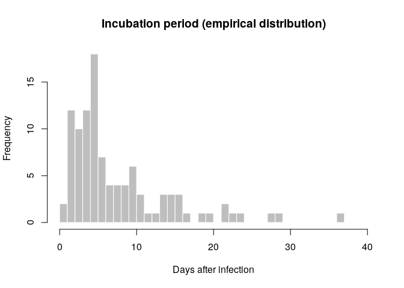<!-- -->

As for the serial interval, use the function `fit_disc_gamma` to fit a
Gamma distribution to these empirical estimates.

``` r
incub_fit <- fit_disc_gamma(incub_obs)
incub_fit
```

    ## $mu
    ## [1] 8.518541
    ## 
    ## $cv
    ## [1] 0.6840563
    ## 
    ## $sd
    ## [1] 5.827161
    ## 
    ## $ll
    ## [1] -309.7443
    ## 
    ## $converged
    ## [1] TRUE
    ## 
    ## $distribution
    ## A discrete distribution
    ##   name: gamma
    ##   parameters:
    ##     shape: 2.13705814653622
    ##     scale: 3.98610612672765

``` r
incub <- incub_fit$distribution
```

Compare this distribution to the empirical data to make sure the results
seem reasonable:

``` r
hist(incub_obs, xlab = "Days after infection", ylab = "Frequency",
     main = "Incubation period: fit to data", col = "salmon", border = "white",
     50, ylim = c(0, 0.15), freq = FALSE, breaks = 0:40)
points(0:60, incub$d(0:60), col = "#9933ff", pch = 20)
points(0:60, incub$d(0:60), col = "#9933ff", type = "l", lty = 2)
```

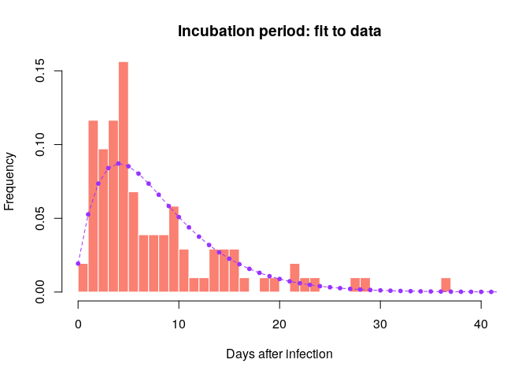<!-- -->

An alternative approach here would be to use estimates of the *mean* and
*standard deviation* of the incubation period and the generation time
published in the literature. From this, one would need to use `epitrix`
to convert these parameters into *shape* and *scale* for a Gamma
distribution, and then use `distcrete` to generate discretised
distributions.

### Using the original `outbreaker` model

The original `outbreaker` model combined temporal information (here,
dates of onset) with sequence data to infer who infected whom. Here, we
use `outbreaker2` to apply this model to the data.

All inputs to the new `outbreaker` function are prepared using dedicated
functions, which make a number of checks on provided inputs and define
defaults. Make sure you names the dates vector, so the DNA labels can be
linked to their respective cases:

``` r
dates <- linelist_clean$date_of_onset
names(dates) <- linelist_clean$case_id
data <- outbreaker_data(dates = dates, # dates of onset
                        dna = dna, # WGS
                        w_dens = si$d(1:100), # generation time distribution
                        f_dens = incub$d(1:100) # incubation period distribution
                        )
```

We also create a configuration, which determines different aspects of
the analysis, including which parameters need to be estimated, initial
values of parameters, the length of the MCMC, etc. If you want see a
progress bar to indicate how long the analysis will take, add an
additional option `pb =
TRUE`:

``` r
ob_config <- create_config(move_kappa = FALSE, # don't look for missing cases
                           move_pi = FALSE, # don't estimate reporting
                           init_pi = 1, # set reporting to 1
                           find_import = FALSE, # don't look for additional imported cases
                           init_tree = "star" # star-like tree as starting point
                           )
```

We can now run the analysis. This should take a couple of minutes on
modern laptops. Note the use of `set.seed(0)` to have identical results
across different users and computers:

``` r
set.seed(0)
res_basic <- outbreaker(data = data, config = ob_config)
res_basic
```

    ## 
    ## 
    ##  ///// outbreaker results ///
    ## 
    ## class:  outbreaker_chains data.frame
    ## dimensions 201 rows,  506 columns
    ## ancestries not shown: alpha_1 - alpha_166
    ## infection dates not shown: t_inf_1 - t_inf_166
    ## intermediate generations not shown: kappa_1 - kappa_166
    ## 
    ## /// head //
    ##   step      post      like    prior           mu pi eps lambda
    ## 1    1 -4212.492 -4214.795 2.302485 1.000000e-04  1 0.5   0.05
    ## 2   50 -1195.248 -1197.551 2.302578 6.670115e-06  1 0.5   0.05
    ## 3  100 -1172.138 -1174.441 2.302578 6.670115e-06  1 0.5   0.05
    ## 
    ## ...
    ## /// tail //
    ##      step      post      like   prior           mu pi eps lambda
    ## 199  9900 -1123.955 -1126.258 2.30258 4.851635e-06  1 0.5   0.05
    ## 200  9950 -1131.066 -1133.369 2.30258 4.851635e-06  1 0.5   0.05
    ## 201 10000 -1156.391 -1158.694 2.30258 4.851635e-06  1 0.5   0.05

``` r
plot(res_basic)
```

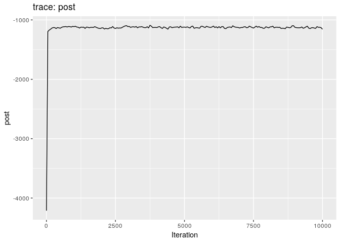<!-- -->

``` r
plot(res_basic, burn = 500)
```

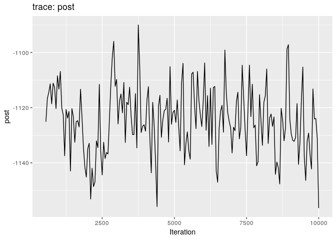<!-- -->

The first two plots show the trace of the log-posterior densities (with,
and without burnin). See `?plot.outbreaker_chains` for details on
available plots. Graphics worth looking at include:

``` r
## ancestry plot
## axis labels are removed because they are too small to make out
plot(res_basic,
     type = "alpha",
     burnin = 500) +
  theme_minimal() +
  theme(axis.text = element_blank(),
        axis.ticks = element_blank())
```

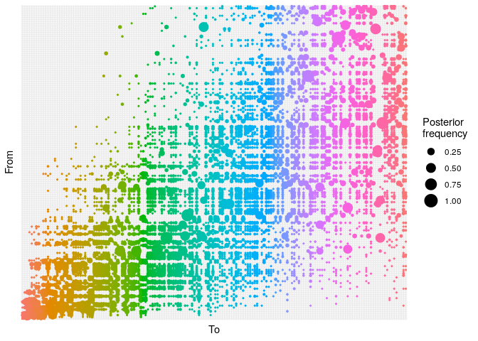<!-- -->

``` r
## infection dates
plot(res_basic,
     type = "t_inf",
     burnin = 500) +
  theme_minimal() +
  theme(axis.text.y = element_blank(),
        axis.ticks.y = element_blank())
```

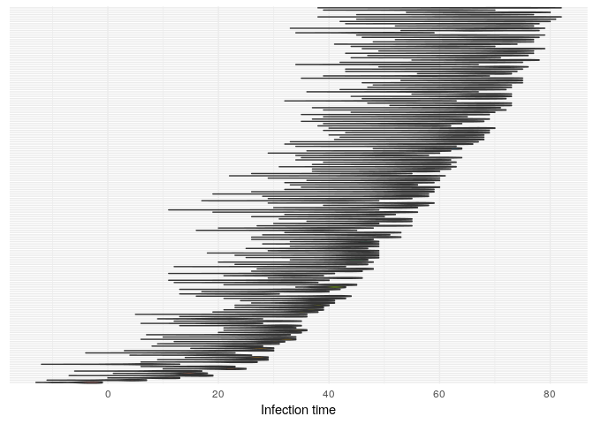<!-- -->

``` r
# mutation rate
plot(res_basic, "mu", burn = 500, type = "density")
```

<!-- -->

``` r
# transmission trees
p <- plot(res_basic,
          type = "network",
          burnin = 500,
          min_support = .05) 
p
```

<!--html_preserve-->

<iframe src="widgets/real-time-response-network-1.html" width="100%" height="500px">

</iframe>

<!--/html_preserve-->

Explain briefly what each of these plots shows, and what (if any)
conclusions can be drawn from them.

  - The `alpha` plot shows the posterior probability of one case
    infecting another. Some ancestries are clearly well resolved (large
    circles), whereas others are not. The clustering of circles into
    rectangles suggests there are clusters of unresolved cases (in this
    case, the genetically identical cases)
  - The `t_inf` plot shows the posterior distribution of infection
    times. For most cases, this distribution is quite flat
  - The `mu` plot simply shows the posterior distribution of mutation
    rate estimates. It is unimodal around 6e-6
  - The `network` plot shows a network of likely infectious
    relationships between cases. You can see the clustering of cases
    that correspond to genetically identical cases.

As a further help for interpretation, you can derive a consensus tree
from the posterior samples of trees using `summary`. Look in particular
at the *support* column.

``` r
smry_basic <- summary(res_basic)
head(smry_basic$tree)
```

    ##   from to time    support generations
    ## 1   NA  1   -4 0.04477612          NA
    ## 2    1  2    4 0.75124378           1
    ## 3    9  3   10 0.34825871           1
    ## 4    9  4   15 0.21890547           1
    ## 5    8  5   14 0.21393035           1
    ## 6    9  6   12 0.31840796           1

``` r
tail(smry_basic$tree)
```

    ##     from  to time    support generations
    ## 161  107 161   70 0.04477612           1
    ## 162  133 162   70 0.09950249           1
    ## 163  103 163   67 0.19402985           1
    ## 164  144 164   72 0.27860697           1
    ## 165   99 165   59 0.06467662           1
    ## 166  109 166   71 0.04477612           1

``` r
hist(smry_basic$tree$support, col = "grey", border = "white",
     main = "Consensus ancestry: support", xlim = c(0,1))
```

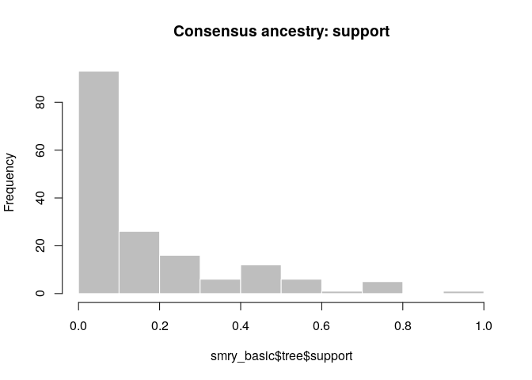<!-- -->

How would you interpret this result? How well resolved is the
transmission tree?

  - The tree is fairly poorly resolved, as most ancestries have \<0.5
    posterior support
  - The genetic data can resolve the outbreak into clusters of identical
    cases, but not beyond that

As a point of comparison, repeat the same analysis using temporal data
only, and plot a graph of ancestries (`type = "alpha"`); you should
obtain something along the lines of:

``` r
set.seed(0)

data <- outbreaker_data(dates = linelist_clean$date_of_onset, # dates of onset
                        w_dens = si$d(1:100), # generation time distribution
                        f_dens = incub$d(1:100) # incubation period distribution
                        )
res_time <- outbreaker(data = data, config = ob_config)

## ancestry plot
## axis labels are removed because they are too small to make out
plot(res_time,
     type = "alpha",
     burnin = 500) +
  theme_minimal() +
  theme(axis.text = element_blank(),
        axis.ticks = element_blank())
```

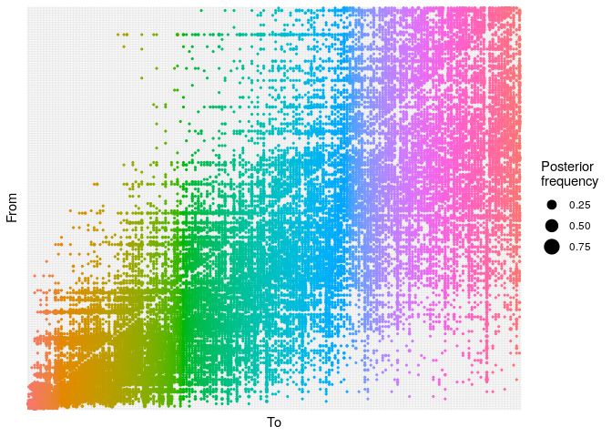<!-- -->

Create a consensus tree, visualise the `support` values and compare to
the results when using temporal and genetic data.

``` r
smry_time <- summary(res_time)
hist(smry_time$tree$support, col = "grey", border = "white",
     main = "Consensus ancestry: support", xlim = c(0,1))
```

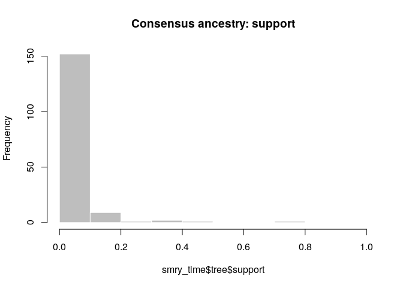<!-- -->

What is the usefulness of temporal and genetic data for outbreak
reconstruction? What other data would you ideally include?

  - Temporal data is not very informative (especially if the generation
    time and incubation period distributions are flat)
  - Genetic data is more informative, but it depends on how large the
    clusters of genetically identical cases are.
  - Complex evolutionary behaviour will also make genetic data less
    informative.
  - Other data: contact tracing, location data, covariates such as age,
    sex, occupation.

### Adding contact data to the reconstruction process

`outbreaker2` natively accepts `epicontacts` objects. Therefore all we
need to do is make an `epi_contacts_clean` object that contains contacts
between cases in `linelist_clean`, and pass it to the `ctd` argument in
`outbreaker_data`. Make sure the `epicontacts` object is defined as the
contacts we have are directional (i.e. specify an infector and
infectee).

``` r
## only keep linelist and contacts elements in linelist_clean
epi_contacts_clean <- epi_contacts[i = linelist_clean$case_id, ## keep linelist
                                   j = linelist_clean$case_id, ## keep contacts
                                   contacts = 'both'] ## both contacts must be in linelist
epi_contacts_clean$directed ## check directionality
```

    ## [1] TRUE

``` r
data <- outbreaker_data(dates = linelist_clean$date_of_onset, # dates of onset
                        dna = dna, # dna sequences
                        ctd = epi_contacts_clean, # contact data
                        w_dens = si$d(1:100), # generation time distribution
                        f_dens = incub$d(1:100) # incubation period distribution
                        )

ob_config <- create_config(move_kappa = FALSE, # don't look for missing cases
                           move_pi = FALSE, # don't estimate reporting
                           init_pi = 1, # set reporting to 1
                           find_import = FALSE, # don't look for additional imported cases
                           init_tree = "star" # star-like tree as starting point
                           )
```

We are now ready to run the analysis. This may take a couple of minutes,
depending on your computer:

``` r
set.seed(0)
res_full <- outbreaker(data = data, config = ob_config)
res_full
```

    ## 
    ## 
    ##  ///// outbreaker results ///
    ## 
    ## class:  outbreaker_chains data.frame
    ## dimensions 201 rows,  506 columns
    ## ancestries not shown: alpha_1 - alpha_166
    ## infection dates not shown: t_inf_1 - t_inf_166
    ## intermediate generations not shown: kappa_1 - kappa_166
    ## 
    ## /// head //
    ##   step      post      like    prior           mu pi        eps      lambda
    ## 1    1 -5228.625 -5230.928 2.302485 1.000000e-04  1 0.50000000 0.050000000
    ## 2   50 -1542.947 -1545.250 2.302566 1.883762e-05  1 0.07355283 0.018468232
    ## 3  100 -1401.486 -1403.789 2.302574 1.107595e-05  1 0.15644756 0.006344793
    ## 
    ## ...
    ## /// tail //
    ##      step      post      like    prior           mu pi       eps
    ## 199  9900 -1256.170 -1258.472 2.302579 5.999178e-06  1 0.3867233
    ## 200  9950 -1250.211 -1252.514 2.302583 1.999904e-06  1 0.3918788
    ## 201 10000 -1240.590 -1242.892 2.302583 1.999904e-06  1 0.3623597
    ##           lambda
    ## 199 0.0001219648
    ## 200 0.0001219648
    ## 201 0.0001219648

Produce graphics as in the previous model. Assess convergence, choose an
appropriate burnin, visualise ancestries and the infection
timelines:

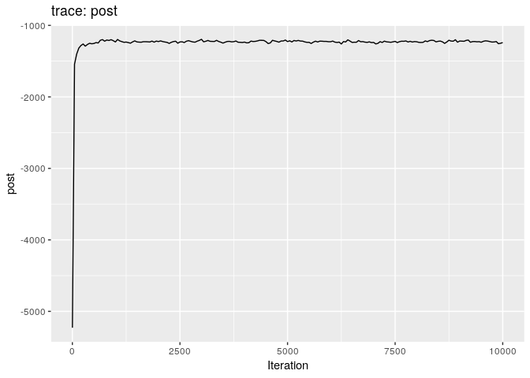<!-- -->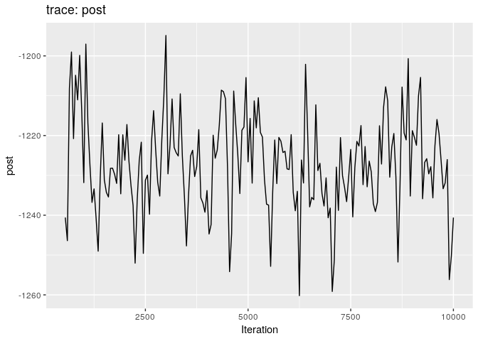<!-- --><!-- -->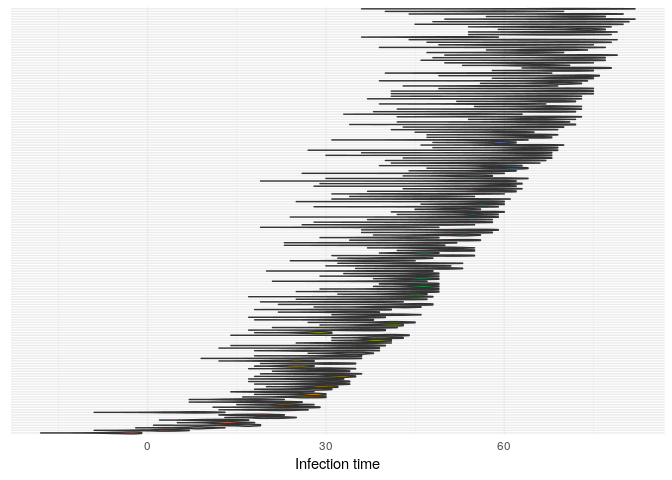<!-- --><!--html_preserve--><iframe src="widgets/real-time-response-network-2.html" width="100%" height="500px"></iframe><!--/html_preserve-->

Derive a consensus tree using `summary`, then visualise the results in
the `support` column. This time set the option `method = 'decycle'` to
remove any cycles in the consensus transmission tree.

``` r
smry_full <- summary(res_full, method = 'decycle')
head(smry_full$tree)
```

    ##   from to time   support generations
    ## 1   NA  1   -4 1.0000000          NA
    ## 2    1  2    2 1.0000000           1
    ## 3    1  3    8 0.3930348           1
    ## 4    6  4   16 0.2338308           1
    ## 5    3  5   13 0.9950249           1
    ## 6    2  6   12 0.3383085           1

``` r
smry_full$tree$support <- round(smry_full$tree$support, 2)

hist(smry_full$tree$support, col = "grey", border = "white",
     main = "Consensus ancestry: support", xlim = c(0,1))
```

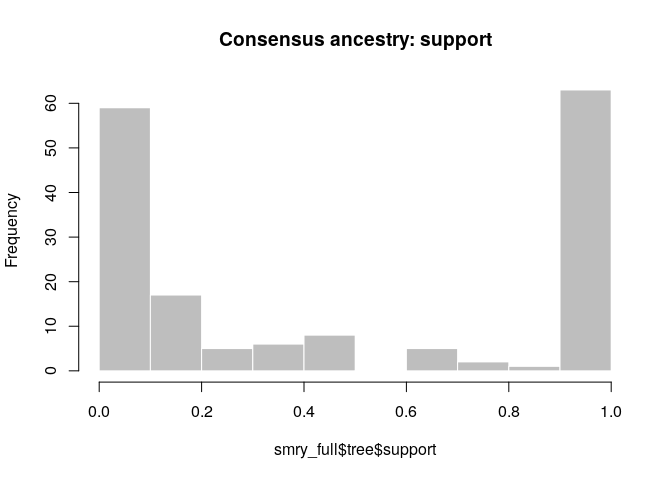<!-- -->

How would you interpret the results? Compare the results to those using
temporal data only, or temporal and genetic data. Can we always rely on
contact data to estimate who infected whom?

  - Contact data clearly resolves additional transmission pairs
  - However, we only have 59 contacts in an outbreak of ~160 cases; many
    ancestries remain unresolved
  - The network plot shows the same results; we still have clusters of
    genetically identical cases with no contact data to further resolve
    them
  - Infection times estimates have not improved much; we haven’t
    integrated information on the timing of contacts to improve these
    estimates
  - Contact data will not always be informative of transmission events:
      - in a very mixed group of people (i.e. a classroom where all
        children have been in contact with each other), many contacts
        exist between non-transmission pairs; this makes the contact
        data less ‘specific’ to transmission events
      - for diseases with long incubation periods, it can be difficult
        to narrow down when infection occured and know which contacts
        are epidemiologically relevant
      - contact tracing is resource intensive and can be inaccurate
        (e.g. people giving false information); quality and quantity of
        the data is not always assured

Now make a new `epicontacts` object to visualise the consensus tree with
meta-information. First convert the index labels in the consensus tree
to the case IDs in linelist. Also include the estimated infection time
from the consensus tree (`smry_full$tree$time`).

``` r
## match index labels to case IDs
smry_full$tree$from <- linelist_clean$case_id[smry_full$tree$from]
smry_full$tree$to <- linelist_clean$case_id[smry_full$tree$to]

## convert infection time estimates from integers to dates
linelist_clean$t_inf_est <- as.Date(smry_full$tree$time,
                                    origin = min(linelist_clean$date_of_onset))

cons_tree <- make_epicontacts(linelist_clean,
                              smry_full$tree,
                              directed = TRUE)
```

In the following, we create color palettes which will be used to display
information on the final graph:

``` r
support_pal <- colorRampPalette(
    c("#918D98", "#645877", "#423359", "#281449", "#1A0340")
)

outcome_pal <- colorRampPalette(
    c("#3288BD", "#ABDDA4")
)
```

Looking carefully at the documentation of `vis_epicontacts`, try to
reproduce the final consensus tree
below:

<!--html_preserve-->

<iframe src="widgets/real-time-response-network-3.html" width="100%" height="500px">

</iframe>

<!--/html_preserve-->

`epicontacts` can now also display timed transmission trees using the
`method = 'ttree'` argument. In the interactive plot below, the colour
of the edges represents the posterior support, the color of the nodes
the outcome, the size of the nodes individual reproductive number
R<sub>i</sub>.

Try adjusting the `height` and `width` arguments so the tree is cleary
visible, then explore clusters of infection by zooming in and out and
moving the tree around. Drag nodes around to improve clarity if need be.
Hover your mouse over the nodes to get more information, single-click on
a node to highlight its subtree and double-click on a node to collapse
it. Set `ttree_shape = 'rectangle'` if you want a tree with right-angled
edges. For more info, see `?vis_ttree`.

``` r
q <- plot(cons_tree,
          method = 'ttree', ## show timed tree
          x_axis = 't_inf_est', ## use 't_inf_est' column for x_axis
          edge_color = "support", ## color edges by posterior support
          edge_col_pal = support_pal, ## specify color palette 
          node_size = 'R_i', ## node size reflects R_i
          ## edge_label = "support", ## not showing for readability
          ## node_shape = "gender", ## not showing for readability
          ## shapes = c(m = "male", f = "female"), ## specify shapes
          width = 1000, ## adjust to improve readability
          height = 1500, ## adjust to improve readability
          node_color = "outcome", ## color nodes by outcome
          hide_labels = TRUE, ## don't show node labels
          date_labels = "%d/%m", ## formatting date labels
          axis_type = 'double', ## show two axes
          col_pal = outcome_pal, ## specify color palette
          node_order = 'subtree_size', ## order nodes vertically by subtree size
          reverse_node_order = TRUE, ## put large subtrees as the bottom
          ttree_shape = 'branching' ## 
          )
learn::save_and_use_widget(q, "real-time-response-network-4.html")
```

<!--html_preserve-->

<iframe src="widgets/real-time-response-network-4.html" width="100%" height="500px">

</iframe>

<!--/html_preserve-->

Are there any conclusions can you draw from these figures?

  - Perhaps some evidence for superspreading events (e.g. 11f8ea,
    9f6884, 0f58c4, f547d6); these largely capture the patterns we saw
    in the contact data
  - No noticeable correlation with recovery status or gender (you can
    check this by colouring by gender or setting the shape to gender)

Now plot the consensus tree, but only including links with more than 30%
posterior support:

``` r
r <- plot(cons_tree[, cons_tree$contacts$support > 0.3],
          method = 'ttree', ## show timed tree
          x_axis = 't_inf_est', ## use 't_inf_est' column for x_axis
          edge_color = "support", ## color edges by posterior support
          edge_col_pal = support_pal, ## specify color palette 
          node_size = 'R_i', ## node size reflects R_i
          ## edge_label = "support",## not showing for readability
          ## node_shape = "gender", ## not showing for readability
          ## shapes = c(m = "male", f = "female"), ## specify shapes
          width = 1000, ## adjust to improve readability
          height = 1500, ## adjust to improve readability
          node_color = "outcome", ## color nodes by outcome
          hide_labels = TRUE, ## don't show node labels
          date_labels = "%d/%m", ## formatting date labels
          axis_type = 'double', ## show two axes
          col_pal = outcome_pal, ## specify color palette
          unlinked_pos = 'middle', ## show unlinked nodes in the middle
          root_order = 't_inf_est', ## order roots by time of infection
          reverse_root_order = TRUE ## show earliest nodes at the top
          )
r
```

<!--html_preserve-->

<iframe src="widgets/real-time-response-network-prune.html" width="100%" height="500px">

</iframe>

<!--/html_preserve-->

Do you think we can reliably answer the question of who infected whom in
this outbreak? How can we improve our estimates?

  - Though support for some ancestries is high, the overall outbreak is
    still not very well resolved — Especially the more recent cases are
    poorly resolved, which are of the most interest
  - More contact data would be useful (currently only have 60 reported
    contacts, whereas we already have genetic data and dates of sampling
    for all cases)
  - Integrate other types of data (i.e. location, covariates such as
    age, gender, occupation, etc.)
