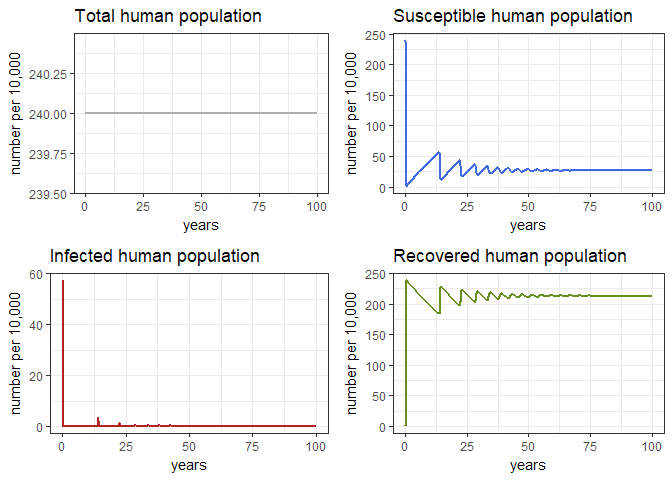
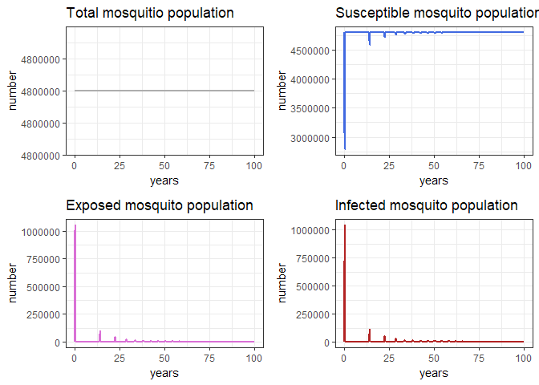
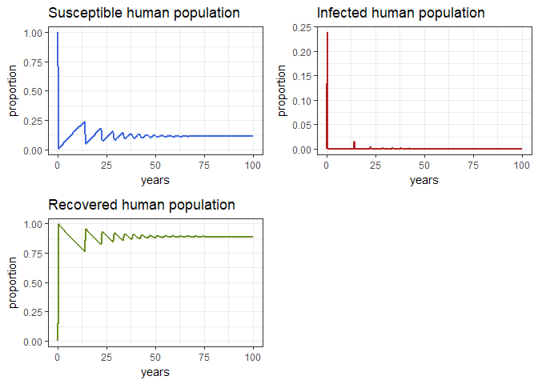
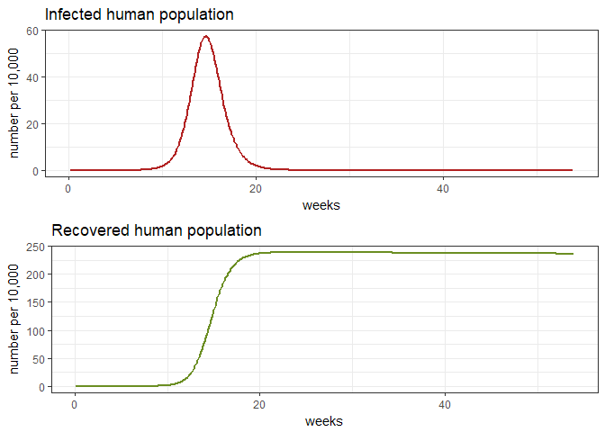

This practical aims to illustrate the basics of **vector borne disease
(VBD) modelling** using R, with an emphasis on how the methods work. We
will use a basic model for an arboviral infection as an example. In this
practical we will begin by gaining some understanding of the components
which contribute to R0 and how potential interventions influence
transmission. Later in the practical you will construct a model of Zika
transmission to look at the effects of several parameters.

Core Concepts
-------------

From the previous lecture, we will futher develop these concepts:

-   Herd effect
-   Biology of the mosquito
-   Natural history of the infection in humans
-   Contact rate
-   Density dependence
-   Immigration-death and age-structured models
-   Infection and morbidity control / elimination of infection
-   Control strategies (on vectors and on humans)

Required packages
-----------------

``` r
#install.packages("deSolve", dep=TRUE)
#install.packages("gridExtra", dep = TRUE)
```

Then load the packages using:

``` r
library(deSolve)
library(ggplot2)
library(gridExtra)
## Warning: package 'gridExtra' was built under R version 3.4.4
```

The basic Zika model
--------------------

-   Sh : Susceptible Humans
-   Ih : Ingected/Infectious humans
-   Rh : humans recovered from infection (with lifelasting immunity)
-   Sv : Susceptible vectors
-   Ev : Exposed vectors
-   Iv : Infected vectors

The flow diagram (part I)
-------------------------

In this section, please make a diagram to connect the different
compartments of the model

The parameters
--------------

We will need several parameters to connect the different compartments of
our model.

Please, look at the suplementary material of the paper
<http://science.sciencemag.org/content/early/2016/07/13/science.aag0219>
and look at the parameter table of this model.

Lets’ find the parameter values for the model. Note that we are using
all the parameters in the same time unit (days)

``` r
Lv       <-        # life span of mosquitos (in days)
Lh       <-        # life span of humans (in days)
Iph      <-        # Infectious period in humans (in days)
IP       <-        # Infectious period in vectors (in days)
EIP      <-        # Extrinsic incubation period in adult mosquitos
muv      <-        # mortality of mosquitos
muh      <-        # mortality of humans
gamma    <-        # recovery rate in humans
delta    <-        # extrinsic incubation rate
b        <-        # Bitting Rate
betah    <-        # Probability of transmission from vector to host
betav    <-        # Probability of transmission from host to vector
Nh       <-        # Number of humans (Population of Cali 2.4 million)
m        <-        # Vector to human ratio
Nv       <-        # Number of vectors
R0       <-        # Reproductive number
b        <-        sqrt((R0 ^2 * muv*(muv+delta) * (muh+gamma)) /
                   (m * betah * betav * delta)) # bitting rate

TIME     <-        # Number of years to run the simulation for 
```

The model (Equations)
---------------------

### Humans

$$\\ \\frac{dSh}{dt}  = \\mu\_h N\_h - \\frac {\\beta\_h b}{N\_h} S\_h  I\_v - \\mu\_h  S\_h $$
$$\\ \\frac{dIh}{dt}  = \\frac {\\beta\_h b}{N\_h}S\_h I\_v - (\\gamma\_h + \\mu\_h) I\_h $$
$$\\ \\frac{dRh}{dt}  = \\gamma\_h + I\_h  - \\mu\_v I\_v$$

### Vectors

$$\\ \\frac{dSv}{dt}  = \\mu\_v N\_v  - \\frac{\\beta\_v b} {N\_h} I\_h S\_v - \\mu\_v Sv$$
$$\\ \\frac{dE\_v}{dt}  = \\frac{\\beta\_v b} {N\_h} I\_h S\_v - (\\delta + \\mu\_v) Ev$$
$$\\ \\frac{dI\_v}{dt}  = \\delta Ev - \\mu\_v I\_v$$

Estimating R0 (Reproductive number)
-----------------------------------

We need a formula to estimate R0:
$$ R\_0^2 = \\frac{mb^2 \\beta\_h \\beta\_v \\delta}{\\mu\_v (\\mu\_v+\\delta)(\\mu\_h+\\gamma\_h)} $$

The flow diagram (part II)
--------------------------

Now that you know the equations, complete the flow diagram with the
parameters and the correct connection between the different
compartments.

Finally, the model in R
-----------------------

After having your flow diagram and equations, now please complete the
model below witth the right parameters (PAR)

``` r
arbovmodel <- function (t, x, params) {
  
  Sh <- x[1]    #Susceptible humans
  Ih <- x[2]    #Infected humans
  Rh <- x[3]    #Recovered humans
  Sv <- x[4]    #Susceptible vectors
  Ev <- x[5]    #Susceptible vectors
  Iv <- x[6]    #Infected vectors
  
  with(as.list(params), #local environment to evaluate derivatives
       {
         # Humans
         dSh   <-  PAR * Nh - (PAR * PAR/Nh) * Sh * Iv - PAR * Sh   
         dIh   <-  (PAR * PAR/Nh) * Sh * Iv  - (PAR + PAR) * Ih
         dRh   <-  PAR * Ih  - PAR * Rh
         
         # Vectors
         dSv  <-  muv * Nv - (PAR* PAR/Nh) * Ih * Sv - PAR * Sv 
         dEv  <-   (PAR * PAR/Nh) * Ih * Sv - (PAR + PAR)* Ev
         dIv  <-   PAR * Ev - PAR * Iv
         
         dx   <- c(dSh, dIh, dRh, dSv, dEv, dIv)
         list(dx)
       }
  )
}
```

Solve the system
----------------

In this section, complete and comment that code for:

-   The VALUES for the initial conditions of the system

-   The ARGUMENTS of the **ode** function in the **deSolve** package.

``` r
# Time 
times  <- seq(1,365 * TIME , by = 1)

# Specifying parameters
params <- c(
  muv      <- muv,     
  muh      <- muh,     
  gamma    <- gamma,   
  delta    <- delta,   
  b        <- b,       
  betah    <- betah,   
  betav    <- betav,   
  Nh       <- Nh,      
  Nv       <- Nv
  
)


# Initial conditions of the system
xstart<- c(Sh = VALUE? ,       # meaning?? 
           Ih = VALUE?,        # meaning?? 
           Rh = VALUE?,        # meaning?? 
           Sv = VALUE?,        # meaning?? 
           Ev = VALUE?,        # meaning?? 
           Iv = VALUE?)        # meaning?? 

# Solving the equations
out <- as.data.frame(ode(y      = ARGUMENT?,   # meaning??  
                         times  = ARGUMENT?,   # meaning??     
                         fun    = ARGUMENT?,   # meaning??  
                         parms  = ARGUMENT?,   # meaning??   
```

The results
-----------

In order to have more meaningful display of the results, convert time
units *days* into *years* and into *weeks*

``` r
# Creating time options to display
out$years <- 
out$weeks <- 
  
```

### General Behavior (Human Population)

``` r
# Check the general behavior of the model for the whole 100 years

p1h <- ggplot(data = out, aes(y = (Rh + Ih + Sh)/10000, x = years)) +
  geom_line(color='grey68', size=1) +
  ggtitle ('Total human population') +
  theme_bw() + ylab('number per 10,000')

p2h <- ggplot(data = out, aes(y = Sh/10000, x = years)) +
  geom_line(color='royalblue', size=1) +
  ggtitle ('Susceptible human population') +
  theme_bw() + ylab('number per 10,000')

p3h <- ggplot(data = out, aes(y = Ih/10000, x = years)) +
  geom_line(color='firebrick', size=1) +
  ggtitle ('Infected human population') +
 theme_bw() + ylab('number per 10,000')

p4h <- ggplot(data = out, aes(y = Rh/10000, x = years)) +
  geom_line(color='olivedrab', size=1) +
  ggtitle ('Recovered human population') +
   theme_bw() + ylab('number per 10,000')


grid.arrange(p1h, p2h, p3h, p4h, ncol=2)
```



### General Behavior (Vector Population)

``` r
# Check the general behavior of the model 

p1v <- ggplot(data = out, aes(y = (Sv + Ev + Iv), x = years)) +
  geom_line(color='grey68', size=1) +
  ggtitle ('Total mosquitio population') +
  theme_bw() + ylab('number')

p2v <- ggplot(data = out, aes(y = Sv, x = years)) +
  geom_line(color='royalblue', size=1) +
  ggtitle ('Susceptible mosquito population') +
  theme_bw() + ylab('number')

p3v <- ggplot(data = out, aes(y = Ev, x = years)) +
  geom_line(color='orchid', size=1) +
  ggtitle ('Exposed mosquito population') +
 theme_bw() + ylab('number')

p4v <- ggplot(data = out, aes(y = Iv, x = years)) +
  geom_line(color='firebrick', size=1) +
  ggtitle ('Infected mosquito population') +
   theme_bw() + ylab('number')

grid.arrange(p1v, p2v, p3v, p4v, ncol=2)
```



### Proportion

Let’s take a more careful look at the propotions and discuss them

``` r

p1 <- ggplot(data = out, aes(y = Sh/(Sh+Ih+Rh), x = years)) +
  geom_line(color='royalblue', size=1) +
  ggtitle ('Susceptible human population') +
  theme_bw() + ylab('proportion')

p2 <- ggplot(data = out, aes(y = Ih/(Sh+Ih+Rh), x = years)) +
  geom_line(color='firebrick', size=1) +
  ggtitle ('Infected human population') +
 theme_bw() + ylab('proportion')

p3 <- ggplot(data = out, aes(y = Rh/(Sh+Ih+Rh), x = years)) +
  geom_line(color='olivedrab', size=1) +
  ggtitle ('Recovered human population') +
   theme_bw() + ylab('proportion')

grid.arrange(p1, p2, p3, ncol=2)
```



### The First Epidemic

``` r
# Check the fists epidemic

dat <- out[out$weeks < 54,]

p1e <- ggplot(dat, aes(y=Ih/10000, x=weeks)) +
  geom_line(color='firebrick', size=1) +
  ggtitle ('Infected human population') +
 theme_bw() + ylab('number per 10,000')


p2e<- ggplot(dat, aes(y=Rh/10000, x=weeks)) +
  geom_line(color='olivedrab', size=1) +
  ggtitle ('Recovered human population') +
 theme_bw() + ylab('number per 10,000')


grid.arrange(p1e, p2e)
```



### Lets’ discuss some aspects

-   Sensitivity of the model to change of the R0
-   Sensititity of the model to change of bitting rate
-   What are the reasons of the time lag between epidemics?
-   How we calculate the attack rate
-   What happen if we vaccinate 80% of the population?
-   What is the impact of a vector control programme?

### Modelling control interventions

Now, using this basic model we are going to model the impact of three
different types of interventions, all of them related to vector control.

-   1.  An intervention than reduces the life span of the mosquito

-   1.  An intervention that reduces the carrying capacity

-   1.  An intervention that reduces the probability of transmission

For these three inteventions, try to find literature that explain which
specific interventions can do that and in that way you will parameterise
the model.

About this document
===================

Contributors
------------

-   Zulma Cucunuba & Pierre Nouvellet: initial version

Contributions are welcome via [pull
requests](https://github.com/reconhub/learn/pulls). The source file if
this document can be found
[**here**](https://raw.githubusercontent.com/reconhub/learn/master/content/post/2017-12-04-practical-vbd.Rmd).

Legal stuff
-----------

**License**: [CC-BY](https://creativecommons.org/licenses/by/3.0/)
**Copyright**: Zulma Cucunuba & Pierre Nouvellet, 2017

References
==========
